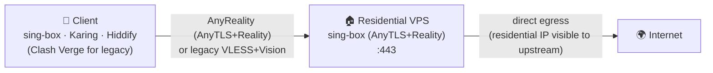
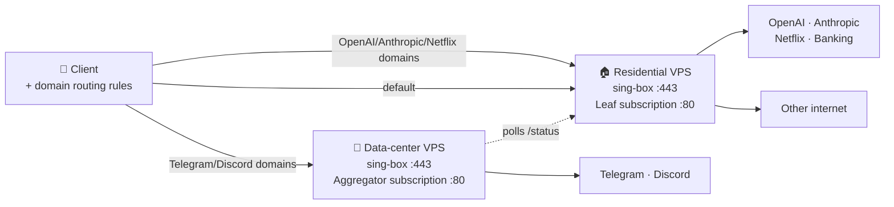

# anyreality-resi-stack — Residential-IP AnyReality (AnyTLS + Reality) stack for sing-box

> Self-hosted proxy deployment toolkit: one Bash command installs **sing-box + AnyTLS + REALITY
> (AnyReality, default)** — or legacy **VLESS + Reality + xtls-rprx-vision** — on an Ubuntu/Debian
> VPS, with an optional zero-dependency Python subscription server, usage-card headers, and
> dual-node smart routing.

[](LICENSE)
[](docs/en/DEPLOYMENT.md)
[](https://sing-box.sagernet.org)
[](docs/en/DEPLOYMENT.md)
[](https://github.com/tytsxai/anyreality-resi-stack/releases)

[简体中文 README](README.md) · [Beginner guide](docs/en/BEGINNER_GUIDE.md) · [Deployment](docs/en/DEPLOYMENT.md) · [Routing rules](docs/en/ROUTING.md) · [Comparison](docs/en/COMPARISON.md) · [llms.txt](llms.txt) · [Changelog](CHANGELOG.md) · [Issues](https://github.com/tytsxai/anyreality-resi-stack/issues)

> This is the English edition. The [Simplified Chinese README](README.md) is the authoritative
> document and is updated first; every guide under `docs/en/` mirrors its `docs/zh-CN/` counterpart.

## 30-second fit check

- **What it is** — an open-source, auditable, repeatable **sing-box AnyReality (AnyTLS + Reality)
  installer**. The entry point is `install/install.sh`. Legacy VLESS + Reality is still selectable.
- **Problem solved** — turns a VPS you already own (especially a residential-IP VPS) into a proxy
  node your clients can import, and optionally uses dual-node rules to work around the soft
  throttling Telegram and Discord apply to some residential subnets.
- **Who it is for** — individual developers, small teams, AI-tool users, and multi-device users who
  own a VPS, are comfortable with SSH, and want to avoid maintaining a web panel.
- **What it is not** — not a residential-IP provider, not a proxy-selling panel, not a multi-user
  billing system, and it makes no promise about bypassing any service's account risk controls or
  regional policy.
- **Two things to know first** — ① the client profile it hands out **ships complete routing rules**
  (China-direct, ad-block, LAN-direct), so TUN mode works on import
  ([routing rules](docs/en/ROUTING.md)); ② the subscription server runs on **plain HTTP :80** and
  the profile contains your node password, so **the subscription URL is a credential — never share
  it** ([SECURITY.md](SECURITY.md#subscription-url-exposure--订阅地址的暴露面)).

## Project summary

| Field | Answer |
| --- | --- |
| Project type | Open-source self-hosted proxy deployment stack; not a proxy-selling panel, does not sell IPs |
| Core use | Deploy sing-box AnyReality (AnyTLS+Reality, default) or legacy VLESS+Reality nodes on residential or regular VPS hosts, and generate importable client subscription profiles |
| Problem solved | Residential egress is valuable for OpenAI, Anthropic, banking, and streaming, while Telegram/Discord may downrank some residential subnets; this project routes traffic by domain to the better exit |
| Who it is for | Developers, small teams, AI-tool users, and multi-device users who own VPS servers and prefer simple auditable automation |
| Tech stack | Bash installer, sing-box, AnyTLS, Reality, VLESS, xtls-rprx-vision, Python stdlib HTTP server, systemd, UFW, fail2ban, sing-box JSON / Clash YAML |
| Supported OS | Ubuntu 22.04+ / 24.04 LTS, Debian 12+ |
| License | GPL-3.0 |
| Former name | `tytsxai/reality-resi-stack` (v1.x; old links redirect here) |
| Runtime services | `sing-box`, `subscription-leaf`, `subscription-aggregator`, `config-backup.timer` |
| Main config paths | `/etc/sing-box/conf`, `/etc/anyreality-resi-stack/`, `/var/lib/anyreality-resi-stack/` (v2.0 unified the prefix; the installer migrates v1.x paths and units in place without losing keys, state, or backups) |

## Why this exists

Most VLESS installers (XHTTP-Installer, 3x-ui, x-ui, …) target the *cheap-VPS-bypass-censorship*
use case. They assume your server IP is disposable and the more you hide it, the better.

**A premium residential-IP VPS is the opposite trade-off.** You bought it precisely *because*
services that reward "real-home-user" reputation — OpenAI, Anthropic, banking, Netflix — treat
residential egress better than data-center egress. But the same residential subnet often gets
soft-throttled by messengers (Telegram, Discord) when a neighbor on the same /24 was previously
flagged. The symptom: stalled file uploads, dropped voice frames, a sticky "sending…".

`anyreality-resi-stack` assumes your residential IP is an asset worth defending — and that the few
services hostile to it should be routed *around* the asset rather than dragging it down.

## Quick start

```bash
bash <(curl -fsSL https://raw.githubusercontent.com/tytsxai/anyreality-resi-stack/main/install/install.sh) \
  --node-name "US-Resi-01" \
  --sni addons.mozilla.org \
  --with-subscription
```

On Ubuntu 22.04+ / Debian 12+ this single command performs: system tuning (BBR / swap / journald
limits) → sing-box install (official apt repo with a pinned GPG fingerprint) → UUID, Reality keypair
and AnyTLS password generation → **AnyReality (AnyTLS + Reality) inbound configuration** (default;
pass `--protocol vless-vision` for legacy VLESS+Reality) → systemd service enablement → UFW +
fail2ban → subscription server with usage card → daily systemd-timer config backup → end-to-end
self-check.

The quick-start command tracks `main`. For repeatable installs, pin a branch or tag with
`ANYREALITY_RESI_STACK_REF=<tag-or-branch>`; for automation use `--config FILE --non-interactive`;
to preview without changing anything use `--dry-run`.

First deployment? Read the [beginner guide](docs/en/BEGINNER_GUIDE.md) — it is ordered as
"checks before buying a VPS → SSH → dry-run → real install → client import → verify egress".

For a dual-node deployment with smart routing, add
`--with-aggregator http://<leaf>/<token>/status` plus the residential-node variables documented in
[docs/en/DUAL-NODE.md](docs/en/DUAL-NODE.md).

## After install: 3 steps to go live

The installer prints a completion card with node name / protocol / IP / port / SNI, the
**AnyReality client credentials** (or a `vless://` link in legacy mode), and — when the subscription
server is enabled — a subscription URL `http://<your-ip>/<SUB_TOKEN>`.

**1. Get the config** — pick one:

```text
# Option A (recommended): subscription URL — clients auto-sync and show the usage card
#   AnyReality (default) -> import with a sing-box client: sing-box official apps (SFA/SFI/SFM), Karing, Hiddify
#   Legacy vless-vision  -> import with a Clash client: Clash Verge, mihomo, Stash
http://<your-ip>/<SUB_TOKEN>/

# Option B: manual. Full client-config samples (placeholder values, do not use as-is):
examples/single-node/sing-box-client-config.json      # single-node AnyReality
examples/dual-node/sing-box-client-dual.json          # dual-node AnyReality + domain routing
examples/single-node/vless-link.txt                   # legacy vless:// share link
```

**2. Import into a client** — see [client import](docs/en/CLIENTS.md). Manual AnyReality fields:
`type=anytls`, `server`, `port`, `password`, `tls.server_name=<SNI>`, `utls fingerprint=chrome`,
`reality public_key` + `short_id`.

**3. Verify egress** — the imported sing-box client opens a local mixed proxy on `127.0.0.1:2080`;
use it to confirm the exit really is your residential IP:

```bash
# Client side: should print your VPS residential IP
curl -x socks5h://127.0.0.1:2080 https://api.ipify.org

# Server side health checks
curl -fsS http://<your-ip>/healthz          # subscription liveness
systemctl status sing-box --no-pager        # node service status
```

Wrong exit IP, client cannot connect, Telegram still slow? See
[troubleshooting](docs/en/TROUBLESHOOTING.md).

## Architecture

### Single-node (default)



### Dual-node with smart routing



The client downloads a *single* subscription URL from the aggregator. That URL returns a profile
listing **both** nodes plus the routing rules — a full sing-box config (`profile.json`) by default
with AnyReality, or a Clash profile (`profile.yaml`) under legacy `--protocol vless-vision`. Traffic
accounting still reflects the residential node's quota: the aggregator polls the leaf and caches the
result, degrading gracefully if the leaf is briefly unreachable.

## Core features

- **One-line install** — `install/install.sh` handles preflight checks, sing-box installation,
  Reality key generation, config rendering, systemd units, UFW / fail2ban, the backup timer, and a
  self-check.
- **AnyTLS + REALITY (AnyReality, default)** — listens on `443/tcp`, needs no domain and no TLS
  certificate. AnyTLS custom padding makes TLS-in-TLS harder to fingerprint; Reality supplies the
  server-side camouflage. Stronger against detection, but sing-box ecosystem only.
- **VLESS + Reality + xtls-rprx-vision (legacy, optional)** — switch with `--protocol vless-vision`.
  The most mature ecosystem and the one Clash / mihomo clients support.
- **Subscription server** — `subscription/leaf_server.py` uses only the Python standard library and
  serves `/<TOKEN>/`, `/<TOKEN>/status`, and `/healthz`, sampling interface counters in the
  background and returning a `Subscription-Userinfo` header so clients render a usage card.
- **Routing that works out of the box** — the client profile ships four rule layers: LAN-direct,
  ad-block, **China domain/IP direct (inline safety net plus `geosite-cn` / `geoip-cn`)**, and QUIC
  blocking. Import and go in TUN mode. See [routing rules](docs/en/ROUTING.md).
- **Dual-node smart routing** — residential node carries OpenAI / Anthropic / Netflix; data-center
  node carries Telegram / Discord and anything else hostile to residential subnets.
- **Operability** — `--dry-run`, `--non-interactive`, `--config`, idempotent re-runs, daily config
  backups, log size limits, BBR, swap, health checks.
- **Safety boundaries** — every server generates its own UUID / Reality key / subscription token;
  the repository ships a redaction scanner and a hash-only denylist so real credentials cannot be
  committed.

## Which tool should I use?

| Scenario | Recommendation |
| --- | --- |
| One VPS, want a personal AnyReality / VLESS Reality node quickly | `anyreality-resi-stack` |
| Residential IP mainly for OpenAI / Claude / Netflix, but Telegram / Discord are painful | `anyreality-resi-stack` dual-node mode |
| Need multiple users, expiry dates, traffic quotas, a web panel, and an admin API | 3x-ui / x-ui fits better |
| Just learning the underlying Xray / sing-box configuration | Hand-written configs or the official docs |
| Do not want to run a server at all, just buy ready-made nodes | A commercial proxy service |

A scored comparison for the specific "self-hosted residential-IP AnyReality, beginner-viable, low
maintenance" scenario lives in [comparison](docs/en/COMPARISON.md).

## Fit and limits

**Good fit**

- You own a residential-IP VPS and want that exit used for OpenAI, ChatGPT, Claude, banking, and
  streaming — services that care about IP reputation.
- You already have one residential VPS and one regular data-center VPS and want domain rules to
  divert Telegram / Discord traffic to the backup node.
- You do not want to maintain a 3x-ui / x-ui style panel and only need a single-user, auditable,
  repeatably deployable node.
- You want the subscription URL to sync configuration and display usage in v2rayN, Clash Verge,
  Stash, Shadowrocket, and similar clients.

**Not a fit**

- This project provides no residential IPs and no server resources — bring your own VPS.
- No multi-user panel, billing system, commercial proxy management, or enterprise multi-tenancy.
- No support for CentOS 7, Alpine, OpenWRT, Docker-only, or Kubernetes deployments.
- No promise of bypassing any service's account risk controls, regional policy, or protocol
  detection. It only configures your own server into a working proxy exit.

## Security

- All secrets are generated per-server and never committed.
- Repository CI gates on a hash-only denylist plus a secret-shape detector — no UUID, Reality key,
  or IP can land in a PR.
- The sing-box apt repository is verified against a pinned GPG fingerprint; installation refuses to
  proceed on mismatch.
- Threat model and reporting: [SECURITY.md](SECURITY.md).

> ⚠️ **The subscription URL is a credential.** The subscription server is plain HTTP on `:80` and
> the profile returned by `http://<ip>/<SUB_TOKEN>/` contains your node password — anyone on the
> path can read it, and anyone who learns the URL has your node. Do **not** paste the full URL into
> issues, screenshots, or chat groups, and do **not** put backup files into `FILE_DIR` (the same
> token path would serve them). For stronger protection, front it with a TLS reverse proxy, or fetch
> the profile once over `scp` and disable the subscription server. Full write-up in
> [SECURITY.md](SECURITY.md#subscription-url-exposure--订阅地址的暴露面).

## FAQ

**Telegram file uploads stall on my residential VPS — "sending…" spins forever. What now?**
Telegram soft-throttles residential subnets that have historically hosted bots. Enable **dual-node
mode** and route `geosite:telegram` out through the data-center node; the problem goes away.

**OpenAI says "unsupported region" on my data-center VPS, but Telegram gets slow on the residential
one. How do I get both?**
That is the entire reason this project exists: OpenAI / Anthropic / banking / Netflix leave through
the residential exit, Telegram / Discord leave through the data-center node, and the client only
ever sees one subscription.

**What is the default protocol, and how do I choose between AnyReality and VLESS+Reality?**
The default is **AnyReality (AnyTLS + Reality)**: AnyTLS custom padding makes TLS-in-TLS harder to
target and Reality adds server-side camouflage, so detection resistance is better — but **only the
sing-box ecosystem supports it** (sing-box official apps, Karing, Hiddify). Clash-family clients
(Clash Verge, mihomo, Stash) **cannot** use AnyReality; deploy legacy VLESS+Reality+Vision with
`--protocol vless-vision` instead. Neither requires a domain or a certificate.

**I just imported the subscription and now Chinese sites are slow. Is the node broken?**
No. In TUN mode there is no "global / direct" switch — routing rules alone decide what is proxied,
and incomplete rules push domestic traffic overseas. The profile this project generates ships four
rule layers (LAN-direct → ad-block → China-direct → proxy fallback) and works on import. If you
hand-edited the config or used a template from elsewhere, check it against
[routing rules](docs/en/ROUTING.md). Note also that `geosite-cn` rule sets are downloaded from
GitHub and fail closed on first start if unreachable — which is why this project inlines an
additional ~60-entry China-domain safety net that needs no network request.

**Is the subscription URL HTTPS? Can I share it?**
No — it is plain HTTP on `:80`, and the profile contains your node password. **Whoever has the URL
has your node.** Never share it publicly, paste it into an issue, or screenshot it. Add your own TLS
reverse proxy, or fetch the profile once with `scp` and shut the subscription server down. Also keep
backup files out of `FILE_DIR`, since the same token path would serve them. See
[SECURITY.md](SECURITY.md#subscription-url-exposure--订阅地址的暴露面).

**Does Reality need a domain and a certificate?**
No — that is its biggest advantage over Trojan / V2Ray-TLS. Both AnyReality and legacy VLESS mode
default to an `addons.mozilla.org` camouflage SNI, which you can swap for any high-reputation domain.

**Why does the default config block UDP 443 (QUIC / HTTP3)?**
AnyTLS + Reality is TCP-only, so QUIC traffic cannot traverse the node. Left unblocked, browsers
retry HTTP/3 and only fall back to TCP after a timeout — which users experience as "pages hang for a
few seconds first". Blocking `udp:443` forces the fallback to happen immediately. Delete the rule if
you do not want that behaviour; see [routing rules](docs/en/ROUTING.md).

**Can I re-run the installer? Will it wipe my UUID and Reality keys?**
The script is **idempotent**: re-running changes neither the UUID nor the Reality keypair. A daily
systemd timer also backs up the sing-box configuration.

**Why require Ubuntu 22.04+ / Debian 12+? What about CentOS 7 or Alpine?**
Not supported. BBR, journald limits, the sing-box apt repository, and GPG fingerprint verification
all assume a modern systemd + apt system. This is a deliberate limit: a smaller compatibility matrix
in exchange for stability.

**How is this different from 3x-ui / x-ui / XHTTP-Installer?**
Those are built for "cheap VPS, bypass censorship" (multi-user, panel, hide the exit IP). This
project is built on the opposite premise — **your residential IP is an asset** — so it defaults to a
single UUID, does not hide the IP, and diverts only the few services hostile to residential subnets.

**GPL-3.0 — can I use this inside a closed-source company project?**
No. You would need to release under GPL-3.0, or negotiate commercial licensing with the sing-box
community/authors.

## Documentation

| Guide | Link |
| --- | --- |
| Documentation index | [docs/README.md](docs/README.md) |
| Beginner guide | [docs/en/BEGINNER_GUIDE.md](docs/en/BEGINNER_GUIDE.md) |
| Deployment | [docs/en/DEPLOYMENT.md](docs/en/DEPLOYMENT.md) |
| Subscription server design | [docs/en/SUBSCRIPTION.md](docs/en/SUBSCRIPTION.md) |
| Dual-node + smart routing | [docs/en/DUAL-NODE.md](docs/en/DUAL-NODE.md) |
| Client routing rules | [docs/en/ROUTING.md](docs/en/ROUTING.md) |
| Client import | [docs/en/CLIENTS.md](docs/en/CLIENTS.md) |
| Troubleshooting | [docs/en/TROUBLESHOOTING.md](docs/en/TROUBLESHOOTING.md) |
| Comparison with similar tools | [docs/en/COMPARISON.md](docs/en/COMPARISON.md) |

For AI search engines and retrieval tools, see [llms.txt](llms.txt) — a compact machine-readable
summary of the project purpose, boundaries, docs map, and useful search phrases.

## Contributing

PRs welcome. Read [CONTRIBUTING.md](CONTRIBUTING.md) first — lint gates are strict, and any change
touching install scripts must pass `make test && make lint && make redact && make examples`.

## License

GPL-3.0. See [LICENSE](LICENSE).

---

**Search keywords**: AnyReality, AnyTLS Reality, sing-box AnyTLS Reality installer, residential IP
proxy, residential IP VLESS, VLESS Reality residential proxy, sing-box residential installer,
self-hosted proxy stack, OpenAI residential IP exit, ChatGPT residential proxy, Telegram residential
IP slow upload, Discord residential IP throttling, Clash domain routing, dual-node smart routing,
alternative to 3x-ui for residential VPS, sing-box subscription server.
