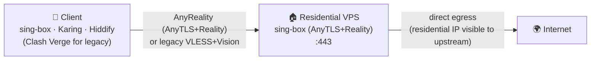
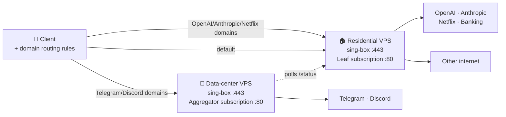

# anyreality-resi-stack

**Self-hosted residential-IP AnyReality (AnyTLS + Reality) stack for sing-box**

`anyreality-resi-stack` (formerly `reality-resi-stack`) is an open-source (GPL-3.0), auditable **Bash one-line installer** that deploys **sing-box + AnyTLS + REALITY (AnyReality, default)** on **Ubuntu 22.04+ / Debian 12+** VPS hosts — with optional legacy **VLESS + Reality + xtls-rprx-vision**, a zero-dependency Python subscription server, usage cards, and dual-node domain routing. Entry point: [`install/install.sh`](install/install.sh).

It is **not** a residential-IP vendor, multi-user panel, or commercial proxy marketplace. You bring the VPS; this repo configures it.

[](LICENSE)
[](docs/en/DEPLOYMENT.md)
[](https://sing-box.sagernet.org)
[](docs/en/DEPLOYMENT.md)
[](https://github.com/tytsxai/anyreality-resi-stack/releases)

[简体中文 README](README.md) · [Beginner guide](docs/en/BEGINNER_GUIDE.md) · [Examples](docs/en/EXAMPLES.md) · [FAQ](docs/en/FAQ.md) · [Deployment](docs/en/DEPLOYMENT.md) · [Clients](docs/en/CLIENTS.md) · [Routing](docs/en/ROUTING.md) · [Comparison](docs/en/COMPARISON.md) · [llms.txt](llms.txt) · [Changelog](CHANGELOG.md)

> English edition. The [Chinese README](README.md) is authoritative and updated first; `docs/en/` mirrors `docs/zh-CN/`.

## What / why / who

| | |
| --- | --- |
| **What** | Self-hosted proxy **deployment stack**: installer + sing-box templates + Python subscription servers + docs |
| **Problem** | Configure your residential or DC VPS as an importable node; optional dual-node sends OpenAI-class traffic via residential egress and Telegram/Discord via a DC fallback |
| **Who** | People who own a VPS, use SSH, and prefer Bash+systemd over a web panel |
| **Default protocol** | **AnyReality (AnyTLS+REALITY)** — recommended default for China-region self-hosting; see [scorecard](#protocol-scorecard--why-anyreality-is-the-china-region-best-pick-now) |
| **Stack** | Bash, sing-box, AnyTLS, REALITY, VLESS/Vision (legacy), Python stdlib HTTP, systemd, UFW, fail2ban |
| **OS** | Ubuntu 22.04+ / 24.04 LTS, Debian 12+ |
| **Paths** | `install/install.sh`; runtime `/etc/sing-box/conf`, `/etc/anyreality-resi-stack/` |

**Two things first:** ① client profiles ship China-direct / ad-block / LAN-direct rules for TUN ([routing](docs/en/ROUTING.md)); ② subscription is **plain HTTP :80** and contains the node password — **the URL is a credential** ([SECURITY.md](SECURITY.md#subscription-url-exposure--订阅地址的暴露面)).

## Quick start

```bash
# Preview only
bash <(curl -fsSL https://raw.githubusercontent.com/tytsxai/anyreality-resi-stack/main/install/install.sh) \
  --node-name "US-Resi-01" --sni addons.mozilla.org --with-subscription --dry-run

# Install (default AnyReality)
bash <(curl -fsSL https://raw.githubusercontent.com/tytsxai/anyreality-resi-stack/main/install/install.sh) \
  --node-name "US-Resi-01" \
  --sni addons.mozilla.org \
  --with-subscription
```

What it does: preflight + BBR/swap → sing-box from official apt (GPG-pinned) → Reality keys + AnyTLS password → AnyReality inbound on `:443` → systemd / UFW / fail2ban → optional subscription + daily backup → self-check. Clash/mihomo: add `--protocol vless-vision`.

| Need | How |
| --- | --- |
| Pin version | `ANYREALITY_RESI_STACK_REF=<tag>` |
| Unattended | `--config FILE --non-interactive` |
| First time | [Beginner guide](docs/en/BEGINNER_GUIDE.md) |
| More recipes | [Examples](docs/en/EXAMPLES.md) |

Import the completion-card subscription URL with a **sing-box client** (SFA/SFI/SFM, Karing, Hiddify, NekoBox), then:

```bash
curl -x socks5h://127.0.0.1:2080 https://api.ipify.org
curl -fsS http://<your-ip>/healthz
systemctl status sing-box --no-pager
```

## Core features

- One-line install: `install/install.sh` (`--dry-run` / `--non-interactive` / `--config` / idempotent)
- AnyReality default: AnyTLS padding + REALITY camouflage, **no domain/cert**; sing-box clients only
- Legacy VLESS+Vision: `--protocol vless-vision` for Clash/mihomo (compatibility, not preferred)
- Subscription: `subscription/leaf_server.py`, `/<TOKEN>/`, `/status`, `/healthz`, usage card
- Ready-made routing: LAN direct → ad block → China direct → reject UDP/443 → proxy
- Dual-node: residential for OpenAI/Anthropic/Netflix; DC for Telegram/Discord ([DUAL-NODE](docs/en/DUAL-NODE.md))
- Ops defaults: systemd, UFW, fail2ban, BBR, swap, backup timer, health checks
- Safety: per-host secrets; redact + hash denylist in CI

## Use cases

| Scenario | Recommendation |
| --- | --- |
| Residential VPS for ChatGPT / Claude / banking / streaming reputation | This stack, single node + subscription |
| Residential works for AI but TG/Discord uploads stall | [Dual-node](docs/en/DUAL-NODE.md) |
| Single-user, no panel, auditable | This stack |
| Multi-user billing / web admin API | 3x-ui / x-ui |
| Must use Clash/mihomo | `--protocol vless-vision` or switch clients and use AnyReality |

Deployer comparison: [COMPARISON](docs/en/COMPARISON.md). Protocol comparison: next section.

## Limits

- Does **not** sell VPS/IPs; no multi-user billing, airport panel, K8s/Docker-only/OpenWRT/CentOS 7
- Does **not** claim to bypass account risk controls, regional policy, or protocol blocking
- AnyReality **unsupported** by mihomo/most Clash; **never share** the subscription URL
- Former name `reality-resi-stack` (v1.x) redirects here; runtime prefix is `anyreality-resi-stack`

**Suggested GitHub About:** `Self-hosted residential-IP AnyReality (AnyTLS+Reality) stack for sing-box — Bash installer, Python subscription, dual-node routing.`  
**Suggested topics:** `sing-box` `anytls` `anyreality` `reality` `vless` `residential-ip` `proxy` `self-hosted` `subscription-server` `ubuntu` `debian` `systemd` `openai` `telegram`

AI summary: [llms.txt](llms.txt) · Docs index: [docs/README.md](docs/README.md)

## Why this exists

Most VLESS installers target cheap-VPS bypass. **Residential VPS is the opposite:** you paid for egress reputation (OpenAI, banking, Netflix), yet the same subnet may be soft-throttled by Telegram or Discord. This project treats the residential IP as an asset and routes hostile services around it. Dual-node steps: [DUAL-NODE.md](docs/en/DUAL-NODE.md).

## After install

Completion card: node info, AnyReality credentials (or legacy `vless://`), subscription `http://<IP>/<SUB_TOKEN>/`. Prefer the subscription (sing-box `profile.json`); samples under `examples/`. Manual fields and clients: [CLIENTS.md](docs/en/CLIENTS.md). Verify with the `curl` commands above. Troubleshooting: [TROUBLESHOOTING.md](docs/en/TROUBLESHOOTING.md).

## Protocol scorecard | Why AnyReality is the China-region best pick *now*

> **One-line claim: for China-region self-hosted nodes today, AnyTLS + REALITY (AnyReality) is the best overall protocol choice — and this repository defaults to it.**
>
> This section scores **wire protocols**, not deployers (3x-ui / x-ui). Fixed scenario:
> **China-region users · self-hosted or airport nodes · anti-detection · minimal domain/cert ops · still tracking upstream.**
>
> **Upstream commitment:** the table is not frozen marketing copy. We **revise scores, defaults, and recommendations promptly** as [sing-box](https://sing-box.sagernet.org/), AnyTLS, REALITY, and peer protocols change. The installer tracks the official apt source; this page and the [Changelog](CHANGELOG.md) move with each release. If a stronger combo appears, the default changes — we do not defend a dead narrative.
>
> **Scoring method** (last reviewed: 2026-08): product judgment, not a lab benchmark or a “won’t be detected” guarantee. Approximate weights: anti-detection 20% · certless camouflage 20% · **China-facing evolution 20%** · setup cost 10% · historical stability 10% · client breadth 10% · low-ops self-host fit 10%. China-facing evolution is deliberately heavy so “once most popular but stagnant” loses.

### 30-second decision tree

```text
Can you use a sing-box-family client?
  ├─ Yes → AnyReality (this repo default)     ← best for China region now
  └─ No, must use Clash / mihomo?
        └─ temporary --protocol vless-vision (compatibility, not better)
              migrate back to AnyReality when the client allows

Already on bare AnyTLS? → add REALITY → AnyReality
Already on VLESS+REALITY (China path)? → migrate to AnyReality if clients allow
High loss / need full UDP bandwidth? → Hysteria2 may run in parallel (different track)
Already have domain+cert reverse proxy? → Trojan/TLS works, usually not better than AnyReality
```

### Why “best for China region *now*”

| Criterion | Argument |
| --- | --- |
| Complete anti-detection stack | AnyTLS custom padding + REALITY server camouflage — **both**, not one without the other |
| No domain / cert required | Same class as classic Reality: no domain, renewals, or decoy site |
| China-region evolution | Former “default for most people” **VLESS + REALITY + XHTTP/Vision is stagnant** in the China-facing community (tutorials/panels no longer push new capability on that path) — staying is technical debt |
| Clear migration | From stagnant VLESS Reality **or** bare AnyTLS → **AnyReality**, not half measures |
| Shipped as default here | One-line install, `profile.json` subscription, routing, dual-node all default to AnyReality |

**Structural gap only:** clients are mainly **sing-box-family** (official apps / Karing / Hiddify / NekoBox). **mihomo / most Clash clients do not support it.** Client lock-in → legacy VLESS Vision is **compatibility**, not a better protocol.

### Overall scores (China self-host scenario)

| Protocol | Score | China-region role | Why it loses to AnyReality |
| --- | ---: | --- | --- |
| **AnyTLS + REALITY (AnyReality)** | **4.6** | **Best pick now · repo default** | — |
| VLESS + REALITY + XHTTP / Vision | 3.7 | Former mainstream · **now stagnant** | Broad and stable, but **no longer evolving** on the China-facing side |
| Hysteria2 | 3.4 | Lossy-link specialist | Strong under loss; **UDP/QUIC track**, not REALITY camouflage |
| Bare AnyTLS (no REALITY) | 3.1 | Incomplete | Padding without server camouflage → upgrade to AnyReality |
| Trojan / classic TLS | 2.8 | Legacy option | Domain + cert + reverse-proxy tax; no borrowed fingerprint |
| Shadowsocks 2022 | 2.6 | Low-scrutiny / LAN | Minimal setup; **weak TLS camouflage / active-probe resistance** |

Often asked but not in the main table (to keep the default pick clear): `VMess` (dated fingerprints), `NaiveProxy` (strong camouflage but domain/reverse-proxy heavy), `TUIC` / pure QUIC variants (same UDP track as Hysteria2, not a REALITY substitute).

### Dimensions (higher = better for China self-host)

| Dimension (weight) | **AnyReality** | VLESS+R+XHTTP/Vision | Hysteria2 | Bare AnyTLS | Trojan/TLS | SS2022 |
| --- | ---: | ---: | ---: | ---: | ---: | ---: |
| Anti-detection / traffic fingerprint (20%) | **5** | 4 | 3 | 3 | 3 | 2 |
| Server camouflage / no own domain+cert (20%) | **5** | **5** | 2 | 2 | 1 | 1 |
| **China-facing activity / still evolving (20%)** | **5** | **2 (stagnant)** | 4 | 4 | 2 | 3 |
| Setup / operational cost (10%) | 4 | 3 | 3 | 4 | 2 | **5** |
| Long-term stability · historical field (10%) | 4 | **5** | 4 | 3 | 4 | 4 |
| Client ecosystem breadth (10%) | 3 | **5** | 4 | 3 | **5** | **5** |
| Fit for low-ops self-host (10%) | **5** | 3 | 3 | 2 | 2 | 2 |

How to read it: VLESS Reality still scores on ecosystem and history, but **collapses on China-facing evolution** — “former best ≠ current best.” AnyReality wins on **padding + REALITY camouflage + still moving**.

### Client support (the scorecard’s main trade-off)

| Client | AnyReality | Legacy VLESS+Vision | Notes |
| --- | :---: | :---: | --- |
| sing-box official apps (SFA/SFI/SFM), Karing, Hiddify, NekoBox | ✅ | ✅ | **Recommended path**; default subscription is `profile.json` |
| Clash Verge / mihomo / Stash, etc. | ❌ | ✅ | Requires `--protocol vless-vision`; subscription becomes `profile.yaml` |
| Older `vless://`-only clients | ❌ | depends | Do not force AnyReality |

Import steps: [client import](docs/en/CLIENTS.md).

### Focus notes

#### AnyTLS + REALITY (AnyReality) — preferred for China region now

- **Pros:** custom padding hardens TLS-in-TLS; REALITY adds server camouflage (no domain/cert); flexible in sing-box; clean captures.
- **Cons:** newer than classic Reality; **mihomo unsupported**; mostly sing-box clients.
- **Best for:** **new installs by default**; migrate from stagnant VLESS or bare AnyTLS when the client allows.
- **This repo:** default `--protocol anytls-reality` (flag optional); auth is `ANYTLS_PASSWORD` (**no** UUID / flow).

#### VLESS + REALITY + XHTTP / Vision — stagnant (not the best *now*)

- **Pros:** REALITY without domain/cert; top server-fingerprint elimination; XHTTP/Vision improve shape/performance; most mature ecosystem; long field stability — **what once made it “most people’s first choice.”**
- **Cons:** dest selection matters (TLS 1.3/H2, …); Xray vs sing-box quirks; **China-facing upstream/community largely stalled** → keeping it as default buys technical debt.
- **Best for:** Clash/mihomo-only, or short-term keep of existing nodes.
- **This repo:** `--protocol vless-vision` (legacy compatibility, **not the recommended first pick**).

#### Bare AnyTLS — incomplete; use AnyReality

Padding without REALITY camouflage is not the end state. **AnyReality is the stronger AnyTLS choice.**

#### Other protocols (context, not “better overall”)

| Protocol | Narrow fit | Vs AnyReality |
| --- | --- | --- |
| Hysteria2 | High loss / push bandwidth | Different track; does not replace REALITY camouflage |
| Trojan / classic TLS | You already run domain+cert reverse proxy | Heavier ops; no borrowed fingerprint |
| Shadowsocks 2022 | LAN / minimal scrutiny | Weaker probe resistance and camouflage |

### Migrating to AnyReality in this repo

1. Switch clients to a sing-box-family app (table above).
2. **Re-run the installer** (default AnyReality, or explicit `--protocol anytls-reality`). It swaps inbound templates, mints `ANYTLS_PASSWORD` if needed, and avoids dual inbounds on 443.
3. **Re-import the subscription** on every client: auth becomes a password; profile becomes `profile.json` (not Clash `profile.yaml`).
4. Verify: `curl -x socks5h://127.0.0.1:2080 https://api.ipify.org` should print the node egress IP.

Details: [deployment · protocol choice](docs/en/DEPLOYMENT.md#protocol-choice-anyreality-default-vs-vless-vision-legacy) · [troubleshooting](docs/en/TROUBLESHOOTING.md).

### Boundaries (no over-claim)

- Scores are **scenario product judgment**, not throughput benchmarks or legal/compliance guarantees about detection.
- “Best” means **which protocol path China-region self-hosters should default to**; lossy UDP, heavy TLS reverse proxies, and Clash lock-in are narrow exceptions (see decision tree).
- This project **does not promise** to bypass account risk controls, regional policy, or protocol blocking; it configures a maintainable egress on your VPS.

### Relation to this repository

| Layer | Conclusion |
| --- | --- |
| **Protocol** | AnyReality = best for China region now (above) |
| **Deployment** | `anyreality-resi-stack` ships it as one-line install + subscription + routing; residential dual-node is an extra scenario win |
| **Tooling** | vs 3x-ui / x-ui / manual config: [comparison](docs/en/COMPARISON.md) |

## Architecture

### Single-node (default)


```mermaid
flowchart LR
    Client["📱 Client<br/>sing-box · Karing · Hiddify<br/>(Clash Verge for legacy)"]
    Resi["🏠 Residential VPS<br/>sing-box (AnyTLS+Reality)<br/>:443"]
    Internet["🌍 Internet"]
    Client -->|"AnyReality (AnyTLS+Reality)<br/>or legacy VLESS+Vision"| Resi
    Resi -->|"direct egress<br/>(residential IP visible to upstream)"| Internet
```

### Dual-node with smart routing


```mermaid
flowchart LR
    Client["📱 Client<br/>+ domain routing rules"]
    Resi["🏠 Residential VPS<br/>sing-box :443<br/>Leaf subscription :80"]
    DC["🏢 Data-center VPS<br/>sing-box :443<br/>Aggregator subscription :80"]
    OpenAI["OpenAI · Anthropic<br/>Netflix · Banking"]
    TG["Telegram · Discord"]
    Other["Other internet"]
    Client -->|"OpenAI/Anthropic/Netflix domains"| Resi
    Client -->|"Telegram/Discord domains"| DC
    Client -->|"default"| Resi
    Resi --> OpenAI
    Resi --> Other
    DC --> TG
    DC -.->|"polls /status"| Resi
```

The client downloads a *single* subscription URL from the aggregator. That URL returns a profile
listing **both** nodes plus the routing rules — a full sing-box config (`profile.json`) by default
with AnyReality, or a Clash profile (`profile.yaml`) under legacy `--protocol vless-vision`. Traffic
accounting still reflects the residential node's quota: the aggregator polls the leaf and caches the
result, degrading gracefully if the leaf is briefly unreachable.


## Security

- All secrets are generated per-server and never committed.
- Repository CI gates on a hash-only denylist plus a secret-shape detector — no UUID, Reality key,
  or IP can land in a PR.
- The sing-box apt repository is verified against a pinned GPG fingerprint; installation refuses to
  proceed on mismatch.
- Threat model and reporting: [SECURITY.md](SECURITY.md).

> ⚠️ **The subscription URL is a credential.** The subscription server is plain HTTP on `:80` and
> the profile returned by `http://<ip>/<SUB_TOKEN>/` contains your node password — anyone on the
> path can read it, and anyone who learns the URL has your node. Do **not** paste the full URL into
> issues, screenshots, or chat groups, and do **not** put backup files into `FILE_DIR` (the same
> token path would serve them). For stronger protection, front it with a TLS reverse proxy, or fetch
> the profile once over `scp` and disable the subscription server. Full write-up in
> [SECURITY.md](SECURITY.md#subscription-url-exposure--订阅地址的暴露面).

## FAQ

The highest-frequency questions are below. The full set — 40+ answers covering installer flags,
subscription security, usage accounting, routing behaviour, dual-node, uninstall, and license
boundaries — lives in [docs/en/FAQ.md](docs/en/FAQ.md).

**Telegram file uploads stall on my residential VPS — "sending…" spins forever. What now?**
Telegram soft-throttles residential subnets that have historically hosted bots. Enable **dual-node
mode** and route `geosite:telegram` out through the data-center node; the problem goes away.

**OpenAI says "unsupported region" on my data-center VPS, but Telegram gets slow on the residential
one. How do I get both?**
That is the entire reason this project exists: OpenAI / Anthropic / banking / Netflix leave through
the residential exit, Telegram / Discord leave through the data-center node, and the client only
ever sees one subscription.

**What is the default protocol, and how do I choose between AnyReality and VLESS+Reality?**
The default is **AnyReality (AnyTLS + Reality)** — on our scorecard the **best overall protocol for
China-region self-hosting right now** (padding + REALITY camouflage + still evolving; China-facing
VLESS Reality has stagnated). **Only the sing-box ecosystem supports it** (official apps, Karing,
Hiddify, NekoBox). Clash-family clients (Clash Verge, mihomo, Stash) **cannot** use AnyReality; use
`--protocol vless-vision` only as a compatibility fallback, then migrate back when you can. Neither
requires a domain or a certificate. Full argument:
[protocol scorecard](#protocol-scorecard--why-anyreality-is-the-china-region-best-pick-now).

**I just imported the subscription and now Chinese sites are slow. Is the node broken?**
No. In TUN mode there is no "global / direct" switch — routing rules alone decide what is proxied,
and incomplete rules push domestic traffic overseas. The profile this project generates ships four
rule layers (LAN-direct → ad-block → China-direct → proxy fallback) and works on import. If you
hand-edited the config or used a template from elsewhere, check it against
[routing rules](docs/en/ROUTING.md). Note also that `geosite-cn` rule sets are downloaded from
GitHub and fail closed on first start if unreachable — which is why this project inlines an
additional ~60-entry China-domain safety net that needs no network request.

**Is the subscription URL HTTPS? Can I share it?**
No — it is plain HTTP on `:80`, and the profile contains your node password. **Whoever has the URL
has your node.** Never share it publicly, paste it into an issue, or screenshot it. Add your own TLS
reverse proxy, or fetch the profile once with `scp` and shut the subscription server down. Also keep
backup files out of `FILE_DIR`, since the same token path would serve them. See
[SECURITY.md](SECURITY.md#subscription-url-exposure--订阅地址的暴露面).

**Does Reality need a domain and a certificate?**
No — that is its biggest advantage over Trojan / V2Ray-TLS. Both AnyReality and legacy VLESS mode
default to an `addons.mozilla.org` camouflage SNI, which you can swap for any high-reputation domain.

**Why does the default config block UDP 443 (QUIC / HTTP3)?**
AnyTLS + Reality is TCP-only, so QUIC traffic cannot traverse the node. Left unblocked, browsers
retry HTTP/3 and only fall back to TCP after a timeout — which users experience as "pages hang for a
few seconds first". Blocking `udp:443` forces the fallback to happen immediately. Delete the rule if
you do not want that behaviour; see [routing rules](docs/en/ROUTING.md).

**How is this different from 3x-ui / x-ui / XHTTP-Installer?**
Those are built for "cheap VPS, bypass censorship" (multi-user, panel, hide the exit IP). This
project is built on the opposite premise — **your residential IP is an asset** — so it defaults to a
single UUID, does not hide the IP, and diverts only the few services hostile to residential subnets.

The rest — installer idempotency, why only Ubuntu 22.04+ / Debian 12+, pinning versions and
unattended installs, recovering a lost subscription URL, usage-accounting semantics, dual-node
deployment, uninstall and rollback, GPL-3.0 boundaries — is answered in the
[full FAQ](docs/en/FAQ.md).

## Documentation

| Guide | Link |
| --- | --- |
| Documentation index | [docs/README.md](docs/README.md) |
| Beginner guide | [docs/en/BEGINNER_GUIDE.md](docs/en/BEGINNER_GUIDE.md) |
| FAQ | [docs/en/FAQ.md](docs/en/FAQ.md) |
| Usage examples | [docs/en/EXAMPLES.md](docs/en/EXAMPLES.md) |
| Deployment | [docs/en/DEPLOYMENT.md](docs/en/DEPLOYMENT.md) |
| Subscription server design | [docs/en/SUBSCRIPTION.md](docs/en/SUBSCRIPTION.md) |
| Dual-node + smart routing | [docs/en/DUAL-NODE.md](docs/en/DUAL-NODE.md) |
| Client routing rules | [docs/en/ROUTING.md](docs/en/ROUTING.md) |
| Client import | [docs/en/CLIENTS.md](docs/en/CLIENTS.md) |
| Troubleshooting | [docs/en/TROUBLESHOOTING.md](docs/en/TROUBLESHOOTING.md) |
| Comparison with similar tools | [docs/en/COMPARISON.md](docs/en/COMPARISON.md) |

For AI search engines and retrieval tools, see [llms.txt](llms.txt) — a compact machine-readable
summary of the project purpose, boundaries, docs map, and useful search phrases.

## Contributing

PRs welcome. Read [CONTRIBUTING.md](CONTRIBUTING.md) first — lint gates are strict, and any change
touching install scripts must pass `make test && make lint && make redact && make examples`.

## License

GPL-3.0. See [LICENSE](LICENSE).

---

**Search keywords**: AnyReality, AnyTLS Reality, sing-box AnyTLS Reality installer, residential IP
proxy, residential IP VLESS, VLESS Reality residential proxy, sing-box residential installer,
self-hosted proxy stack, OpenAI residential IP exit, ChatGPT residential proxy, Telegram residential
IP slow upload, Discord residential IP throttling, Clash domain routing, dual-node smart routing,
alternative to 3x-ui for residential VPS, sing-box subscription server.
