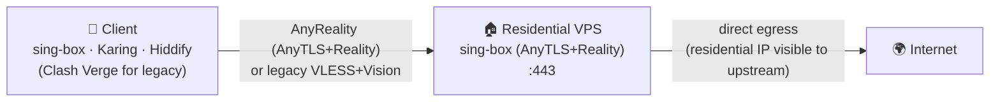
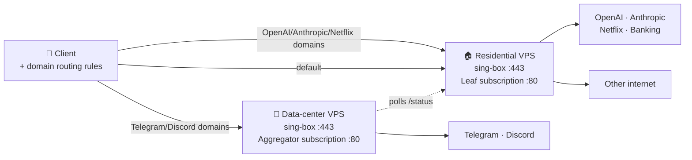

# anyreality-resi-stack

**住宅 IP 优先的 sing-box AnyReality（AnyTLS + REALITY）自托管部署栈**  
**Self-hosted residential-IP AnyReality (AnyTLS + Reality) stack for sing-box**

`anyreality-resi-stack`（前身 `reality-resi-stack`）是一个开源（GPL-3.0）、可审计的 **Bash 一键安装工具包**：在 **Ubuntu 22.04+ / Debian 12+** VPS 上部署 **sing-box + AnyTLS + REALITY（AnyReality，默认）**，也可选遗留 **VLESS + Reality + xtls-rprx-vision**；可选启用零依赖 Python 订阅服务、流量卡片与双节点域名分流。入口：[`install/install.sh`](install/install.sh)。

It is **not** a residential-IP vendor, multi-user panel, or commercial airport. You bring your own VPS; this repo configures it.

[](LICENSE)
[](docs/en/DEPLOYMENT.md)
[](https://sing-box.sagernet.org)
[](docs/en/DEPLOYMENT.md)
[](https://github.com/tytsxai/anyreality-resi-stack/releases)

[English README](README.en.md) · [新手教程](docs/zh-CN/BEGINNER_GUIDE.md) · [命令示例](docs/zh-CN/EXAMPLES.md) · [FAQ](docs/zh-CN/FAQ.md) · [部署](docs/zh-CN/DEPLOYMENT.md) · [客户端](docs/zh-CN/CLIENTS.md) · [分流规则](docs/zh-CN/ROUTING.md) · [同类对比](docs/zh-CN/COMPARISON.md) · [llms.txt](llms.txt) · [Changelog](CHANGELOG.md)

---

## 项目定位 | What / why / who

| | 中文 | English |
|---|---|---|
| **是什么** | 自托管代理**部署栈**：安装器 + sing-box 模板 + Python 订阅服务 + 文档 | Self-hosted proxy **deployment stack**: installer, sing-box templates, Python subscription servers, docs |
| **解决什么** | 把自有住宅/普通 VPS 配成可导入客户端的节点；可选双节点把 OpenAI 等走住宅、Telegram/Discord 走数据中心 | Turn your VPS into an importable node; optional dual-node routes OpenAI-class traffic via residential egress and TG/Discord via DC |
| **适合谁** | 有 VPS、会 SSH、不想养 Web 面板的个人/小团队/AI 工具用户 | Owners of a VPS who prefer Bash+systemd over a panel |
| **默认协议** | **AnyReality（AnyTLS+REALITY）** — 中国区自建场景下本仓库的推荐默认；论证见 [协议评分](#与其他协议的量化评分对比--为什么是中国区当前最优) | **AnyReality** default; legacy VLESS+Vision for Clash/mihomo only |
| **技术栈** | Bash, sing-box, AnyTLS, REALITY, VLESS/Vision(legacy), Python stdlib HTTP, systemd, UFW, fail2ban | same |
| **系统** | Ubuntu 22.04+/24.04, Debian 12+ | same |
| **入口路径** | `install/install.sh`；运行时 `/etc/sing-box/conf`, `/etc/anyreality-resi-stack/` | same |

**先知道的两件事：** ① 客户端配置自带国内直连/广告拦截等规则，TUN 导入即用（[分流规则](docs/zh-CN/ROUTING.md)）；② 订阅默认 **明文 HTTP :80**，URL 含节点密码，**等同凭证，勿外传**（[SECURITY.md](SECURITY.md#subscription-url-exposure--订阅地址的暴露面)）。

## 快速开始 | Quick start

```bash
# 建议先 dry-run 预览（不改系统）
bash <(curl -fsSL https://raw.githubusercontent.com/tytsxai/anyreality-resi-stack/main/install/install.sh) \
  --node-name "US-Resi-01" --sni addons.mozilla.org --with-subscription --dry-run

# 确认无误后去掉 --dry-run 正式安装（默认 AnyReality）
bash <(curl -fsSL https://raw.githubusercontent.com/tytsxai/anyreality-resi-stack/main/install/install.sh) \
  --node-name "US-Resi-01" \
  --sni addons.mozilla.org \
  --with-subscription
```

安装器会：预检与 BBR/swap → 官方 apt 源装 sing-box（GPG 校验）→ 生成 Reality 密钥与 AnyTLS 密码 → 写 AnyReality 入站（`:443`）→ systemd / UFW / fail2ban → 可选订阅与每日备份 → 自检。Clash 系客户端请加 `--protocol vless-vision`。

| 需求 | 做法 |
|---|---|
| 固定版本可重复部署 | `ANYREALITY_RESI_STACK_REF=<tag>` |
| 无人值守 | `--config FILE --non-interactive` |
| 第一次部署 | [新手教程](docs/zh-CN/BEGINNER_GUIDE.md) / [Beginner guide](docs/en/BEGINNER_GUIDE.md) |
| 更多命令 | [命令示例](docs/zh-CN/EXAMPLES.md) |

装完用完成卡上的订阅 URL（`http://<IP>/<TOKEN>/`）导入 **sing-box 系客户端**（SFA/SFI/SFM、Karing、Hiddify、NekoBox），再验证：

```bash
curl -x socks5h://127.0.0.1:2080 https://checkip.amazonaws.com   # 客户端侧，应等于 VPS 出口
curl -fsS http://<your-ip>/healthz                        # 订阅存活
systemctl status sing-box --no-pager
```

## 核心功能 | Core features

- **一行安装**：`install/install.sh`（`--dry-run` / `--non-interactive` / `--config` / 幂等重跑）
- **AnyReality 默认**：AnyTLS 自定义填充 + REALITY 服务端伪装，**无需域名/证书**；仅 sing-box 生态
- **遗留 VLESS+Vision**：`--protocol vless-vision`，兼容 Clash/mihomo（兼容退路，非推荐默认）
- **订阅服务**：`subscription/leaf_server.py`（零依赖），`/<TOKEN>/`、`/status`、`/healthz`、`Subscription-Userinfo` 流量卡片
- **开箱分流**：内网直连 → 广告拦截 → 国内直连（内联安全网 + geosite/geoip）→ 拦 UDP/443 → 其余走节点
- **双节点**：住宅承载 OpenAI/Anthropic/Netflix 等；数据中心承载 Telegram/Discord（[DUAL-NODE](docs/zh-CN/DUAL-NODE.md)）
- **运维默认**：systemd、UFW、fail2ban、BBR、swap、配置备份 timer、健康检查
- **安全默认**：每机独立密钥；仓库 redact + hash denylist，禁止凭证入库

## 使用场景 | Use cases

| 场景 | 推荐 |
|---|---|
| 自有住宅 IP VPS，给 ChatGPT / Claude / 银行 / 流媒体用信誉出口 | 本项目单节点 + 订阅 |
| 住宅 IP 好用但 Telegram/Discord 上传卡、语音差 | [双节点智能分流](docs/zh-CN/DUAL-NODE.md) |
| 只要可审计、少暴露面的单用户节点，不要面板 | 本项目（无 Web 管理后台） |
| 多用户计费、到期、Web 面板 | 3x-ui / x-ui 更合适 |
| 必须 Clash/mihomo | `--protocol vless-vision`，或换 sing-box 客户端后上 AnyReality |

部署栈横向对比：[同类评分对比](docs/zh-CN/COMPARISON.md)。协议横向对比见下一节。

## 限制与注意事项 | Limits

- **不提供** VPS / 住宅 IP；**不做** 多用户计费、机场面板、K8s/Docker-only/OpenWRT/CentOS7
- **不承诺** 绕过账号风控、地区政策或协议检测
- AnyReality **不支持** mihomo/多数 Clash；订阅 URL **勿公开**
- 前身仓库名 `reality-resi-stack`（v1.x）会跳转到本仓；运行时前缀已统一为 `anyreality-resi-stack`，就地升级不丢密钥

**GitHub About 建议**：`Self-hosted residential-IP AnyReality (AnyTLS+Reality) stack for sing-box — Bash installer, Python subscription, dual-node routing.`  
**Topics 建议**：`sing-box` `anytls` `anyreality` `reality` `vless` `residential-ip` `proxy` `self-hosted` `subscription-server` `ubuntu` `debian` `systemd` `openai` `telegram`

AI 检索摘要：[llms.txt](llms.txt) · 文档索引：[docs/README.md](docs/README.md)

## 与其他协议的量化评分对比 | 为什么是中国区当前最优

> **一句话结论：在当前中国区自建场景下，AnyTLS + REALITY（AnyReality）是综合最优选择；本仓库默认即此协议。**
>
> 本节比的是**协议本身**（不是 3x-ui / x-ui 等面板工具）。评分场景固定为：
> **中国区用户 · 自建 / 机场节点 · 要抗检测 · 尽量少域名证书运维 · 能跟上游演进**。
>
> **上游跟进承诺**：下表不是写死的广告文案。协议生态、检测形势、客户端支持会变——我们会**按 [sing-box](https://sing-box.sagernet.org/) / AnyTLS / REALITY 及同类协议上游变更及时改分、改默认、改推荐**；安装器跟踪官方 apt 源，本表与 [Changelog](CHANGELOG.md) 随 release 同步。若某天有更强组合出现，会直接改默认，而不是死守旧叙事。
>
> **评分口径**（最近复核：2026-08）：产品判断，不是实验室基准、也不是“保证不被检测”。加权近似：抗检测 20% · 免域名伪装 20% · **中国区是否还在演进 20%** · 落地成本 10% · 历史稳定性 10% · 客户端广度 10% · 少运维自建契合 10%。权重刻意抬高「中国区演进」，所以「曾经生态第一但已停滞」会明显掉分。

### 30 秒决策树

```text
能用 sing-box 系客户端？
  ├─ 是 → 直接 AnyReality（本仓库默认）     ← 中国区当前最优
  └─ 否，必须 Clash / mihomo？
        └─ 暂时 --protocol vless-vision（兼容退路，不是更优协议）
              有机会换客户端时再迁回 AnyReality

已在用纯 AnyTLS？ → 补上 REALITY，上 AnyReality，不要裸跑
已在用 VLESS+REALITY（中国区）？ → 能换客户端就迁 AnyReality；不能换再暂留
弱网高丢包、要吃满 UDP 带宽？ → 可并行考虑 Hysteria2（赛道不同，不替代本方案）
已有完整域名+证书+反代？ → Trojan/TLS 仍可用，但运维更重，一般不优于 AnyReality
```

### 为什么说「中国区当前最优」

| 判断依据 | 说明 |
|---|---|
| 抗检测完整度 | AnyTLS 自定义填充压 TLS-in-TLS 特征，REALITY 补服务器指纹伪装——**填充 + 伪装都有**，比「只有 Reality」或「只有填充」更完整 |
| 无需域名证书 | 和经典 Reality 一样，不买域名、不续证书、不养真站，中国区自建落地成本最低档之一 |
| 中国区演进 | 原「大多数人首选」的 **VLESS + REALITY + XHTTP/Vision 在中国区已停滞**（社区/教程/面板默认路径不再推进该组合的新能力）；继续押旧路线 = 技术债 |
| 可迁移路径清晰 | 从停滞的 VLESS Reality、从纯 AnyTLS，**都应该直接迁到 AnyReality**，而不是两边凑合 |
| 本仓库落地 | 一键装、订阅（`profile.json`）、分流、双节点都按 AnyReality 默认打通；选它不是空推荐，是**默认就能用** |

**唯一结构性短板**：客户端主要在 **sing-box 系**（官方 App / Karing / Hiddify / NekoBox 等），**mihomo / 多数 Clash 系暂不支持**。被客户端锁死 → 用遗留 VLESS Vision 是**兼容妥协**，不是协议更优。

### 总分（中国区自建场景 · 协议横向）

| 协议 | 总分 | 中国区定位 | 为何输给 / 不敌 AnyReality |
|---|---:|---|---|
| **AnyTLS + REALITY（AnyReality）** | **4.6** | **当前最优 · 本仓库默认** | — |
| VLESS + REALITY + XHTTP / Vision | 3.7 | 曾经主流 · **现已停滞** | 生态仍广、长期稳，但**国内侧不再演进**；新装再选它是在买技术债 |
| Hysteria2 | 3.4 | 弱网特化 | 丢包场景强，但走 UDP/QUIC，**不是 REALITY 伪装赛道**；策略与特征模型不同 |
| 纯 AnyTLS（无 REALITY） | 3.1 | 半成品 | 有填充、**缺服务端伪装** → 应升级为 AnyReality，不是终点 |
| Trojan / 传统 TLS | 2.8 | 老牌备选 | 强依赖域名 + 证书 + 真站/反代；运维面大，无 REALITY 级借指纹 |
| Shadowsocks 2022 | 2.6 | 低审查 / 内网 | 部署极简，**TLS 层伪装与抗主动探测明显弱** |

未单独打分但常被问起的：`VMess`（旧特征多，中国区新装不推荐）、`NaiveProxy`（伪装好但依赖域名/反代与较重栈）、`TUIC` / 纯 QUIC 变体（与 Hysteria2 同属 UDP 赛道，不作 REALITY 替代）。它们不进入上表主对比，避免稀释「中国区自建默认该选谁」。

### 维度评分（越高越适合中国区自建）

| 维度（权重） | **AnyReality** | VLESS+R+XHTTP/Vision | Hysteria2 | 纯 AnyTLS | Trojan/TLS | SS2022 |
|---|---:|---:|---:|---:|---:|---:|
| 抗检测 / 流量特征（20%） | **5** | 4 | 3 | 3 | 3 | 2 |
| 服务端伪装 / 免自备域名证书（20%） | **5** | **5** | 2 | 2 | 1 | 1 |
| **中国区活跃度 / 是否还在演进（20%）** | **5** | **2（停滞）** | 4 | 4 | 2 | 3 |
| 配置与落地成本（10%） | 4 | 3 | 3 | 4 | 2 | **5** |
| 长期稳定性 · 历史实测（10%） | 4 | **5** | 4 | 3 | 4 | 4 |
| 客户端生态广度（10%） | 3 | **5** | 4 | 3 | **5** | **5** |
| 与「少运维自建」契合（10%） | **5** | 3 | 3 | 2 | 2 | 2 |

读表：VLESS Reality 在「生态 / 历史稳定性」仍能打，但在**中国区是否还在演进**上掉队——这是「曾经最优 ≠ 现在最优」的关键分差。AnyReality 用**填充 + REALITY 伪装 + 仍在演进**把总分拉到第一。

### 客户端支持（和分数直接相关的短板）

| 客户端 | AnyReality | 遗留 VLESS+Vision | 说明 |
|---|:---:|:---:|---|
| sing-box 官方 App（SFA/SFI/SFM）、Karing、Hiddify、NekoBox | ✅ | ✅ | **推荐路径**；默认订阅 `profile.json` |
| Clash Verge / mihomo / Stash 等 | ❌ | ✅ | 必须 `--protocol vless-vision`，订阅变 `profile.yaml` |
| 仅支持 `vless://` 的旧客户端 | ❌ | 视实现 | 不要硬上 AnyReality |

导入步骤见 [客户端导入](docs/zh-CN/CLIENTS.md)。

### 重点协议说明

#### AnyTLS + REALITY（AnyReality）— 中国区当前首选

- **优点**：自定义填充让 TLS-in-TLS 更难被针对；REALITY 补齐服务器伪装（无需域名证书）；sing-box 实现灵活，抓包侧伪装优秀。
- **缺点**：相对经典 Reality 仍较新；**mihomo 不支持**；生态主要在 sing-box。
- **适用**：**新装默认就选这个**；原 VLESS 中国区用户、纯 AnyTLS 用户，能换客户端就直接迁过来。
- **本仓库**：默认 `--protocol anytls-reality`（可省略）；认证字段是 `ANYTLS_PASSWORD`（密码），**没有** UUID / flow。

#### VLESS + REALITY + XHTTP / Vision — 中国区已停滞（不是现在的最优）

- **优点**：REALITY 无需域名证书、服务器指纹消除顶级；XHTTP / Vision 优化特征与性能；生态最成熟；实测长期稳定——**这些曾经支撑它成为「大多数人首选」**。
- **缺点**：dest 要选好（TLS 1.3 / H2 等）；Xray / sing-box 有细微差异；**中国区上游与社区演进已基本停滞** → 今天再当默认 = 押停更方案。
- **适用**：客户端只剩 Clash / mihomo；或既有节点短期维持。
- **本仓库**：`--protocol vless-vision`（legacy 兼容，**不是推荐首选**）。

#### 纯 AnyTLS — 半成品，直接上 AnyReality

有填充、无 REALITY 伪装。**AnyTLS 用户的更强选择就是 AnyReality**，不要停在纯 AnyTLS。

#### 其他协议（对照，不是「更优默认」）

| 协议 | 仍可考虑的窄场景 | 相对 AnyReality |
|---|---|---|
| Hysteria2 | 高丢包、要吃满带宽 | 赛道不同；不替代 REALITY 伪装方案 |
| Trojan / 传统 TLS | 已有完整域名证书反代 | 运维更重，无借指纹 |
| Shadowsocks 2022 | 内网 / 极低审查 | 抗探测与伪装弱一档 |

### 从旧协议迁到 AnyReality（本仓库）

1. 客户端换成 sing-box 系（见上表）。
2. 在服务器**重跑安装器**（默认同 AnyReality；或显式 `--protocol anytls-reality`）。安装器会换入站模板、必要时补 `ANYTLS_PASSWORD`，并避免双入站抢 443。
3. **客户端必须重新导入**订阅：认证从 UUID/flow 变成密码，默认 profile 从 `profile.yaml` 变成 `profile.json`。
4. 验证：`curl -x socks5h://127.0.0.1:2080 https://checkip.amazonaws.com` 应返回节点出口 IP。

详情：[部署指南 · 协议选择](docs/zh-CN/DEPLOYMENT.md#协议选择anyreality默认vs-vless-vision遗留) · [故障排查](docs/zh-CN/TROUBLESHOOTING.md)。

### 边界（避免过度承诺）

- 评分是**场景化产品判断**，不是吞吐量压测、也不是对抗审查的法律/合规保证。
- 「最优」指：**中国区自建默认该押哪条协议路线**；弱网 UDP、已有重 TLS 反代、必须用 Clash 等窄场景可以另选，见决策树。
- 本项目**不承诺**绕过任何账号风控、地区政策或协议检测；只负责把自有 VPS 配成可维护出口。

### 和本仓库的关系

| 层级 | 结论 |
|---|---|
| **协议层** | AnyReality = 中国区当前最优（上表） |
| **部署层** | `anyreality-resi-stack` 把该协议做成一键安装 + 订阅 + 分流；住宅 IP 双节点是额外场景加分 |
| **工具层** | 和 3x-ui / x-ui / 手写配置比，见 [同类评分对比](docs/zh-CN/COMPARISON.md) |

## 为什么需要这个项目 | Why this exists

多数 VLESS 安装器（3x-ui、x-ui、XHTTP-Installer 等）面向「便宜 VPS + 隐藏出口」。**住宅 IP VPS 相反**：你付更高价格，是因为 OpenAI / Anthropic / 银行 / Netflix 等看重出口信誉；但同一住宅段常被 Telegram / Discord 软降权（上传卡住、「正在发送…」）。

本项目的前提：**把住宅 IP 当资产**——信誉敏感流量走住宅，不友好的少数服务按域名旁路到数据中心备用节点。双节点变量与步骤见 [DUAL-NODE.md](docs/zh-CN/DUAL-NODE.md)。

## 装完之后 | After install

完成卡会打印节点信息、AnyReality 凭据（或遗留 `vless://`）、以及订阅 `http://<IP>/<SUB_TOKEN>/`。

1. **拿配置**：优先订阅 URL（默认返回 sing-box `profile.json`）；占位样例见 `examples/single-node/sing-box-client-config.json`、`examples/dual-node/sing-box-client-dual.json`。
2. **导入客户端**：[CLIENTS.md](docs/zh-CN/CLIENTS.md)。手动字段：`type=anytls`、`server`、`port`、`password`、`tls.server_name`、`utls fingerprint=chrome`、`reality public_key` + `short_id`。
3. **验证**：客户端 `curl -x socks5h://127.0.0.1:2080 https://checkip.amazonaws.com`；服务器 `curl -fsS http://<ip>/healthz`、`systemctl status sing-box`。

排障：[TROUBLESHOOTING.md](docs/zh-CN/TROUBLESHOOTING.md)。

---

## 🏗️ Architecture | 架构

### Single-node (default) | 单节点（默认）



### Dual-node with smart routing | 双节点 + 智能分流



Client downloads a *single* subscription URL from the aggregator. That URL returns a profile listing **both** nodes plus the routing rules — a full sing-box config (`profile.json`) by default with AnyReality, or a Clash profile (`profile.yaml`) under legacy `--protocol vless-vision`. Traffic accounting still reflects the residential node's quota (aggregator polls the leaf and caches the result, falling back gracefully if the leaf is briefly unreachable).

---

## 文档 | Documentation

| 中文 | English |
|---|---|
| [文档索引](docs/README.md) | [Documentation index](docs/README.md) |
| [新手教程](docs/zh-CN/BEGINNER_GUIDE.md) | [Beginner guide](docs/en/BEGINNER_GUIDE.md) |
| [常见问题 FAQ](docs/zh-CN/FAQ.md) | [FAQ](docs/en/FAQ.md) |
| [命令示例](docs/zh-CN/EXAMPLES.md) | [Usage examples](docs/en/EXAMPLES.md) |
| [部署](docs/zh-CN/DEPLOYMENT.md) | [Deployment](docs/en/DEPLOYMENT.md) |
| [订阅服务设计](docs/zh-CN/SUBSCRIPTION.md) | [Subscription server design](docs/en/SUBSCRIPTION.md) |
| [双节点 + 智能分流](docs/zh-CN/DUAL-NODE.md) | [Dual-node + smart routing](docs/en/DUAL-NODE.md) |
| [分流规则](docs/zh-CN/ROUTING.md) | [Client routing rules](docs/en/ROUTING.md) |
| [故障排查](docs/zh-CN/TROUBLESHOOTING.md) | [Troubleshooting](docs/en/TROUBLESHOOTING.md) |
| [客户端导入](docs/zh-CN/CLIENTS.md) | [Client import](docs/en/CLIENTS.md) |
| [同类评分对比](docs/zh-CN/COMPARISON.md) | [Comparison](docs/en/COMPARISON.md) |

机器可读摘要（GEO / AI 检索）：[llms.txt](llms.txt)。

---

## 安全 | Security

- 密钥每机本地生成；CI 哈希 denylist + 形态检测，凭证不得入库
- sing-box apt 源固定 GPG 指纹，不匹配则拒绝安装
- 威胁模型与上报：[SECURITY.md](SECURITY.md)

> ⚠️ **订阅 URL = 凭证。** 默认明文 HTTP `:80`，返回配置含节点密码。勿贴 issue/截图/群聊；勿把备份放进 `FILE_DIR`。可加 TLS 反代，或 `scp` 取一次后关订阅。

---

## ❓ FAQ

下面是最高频的几个问题。更完整的问答（安装参数、订阅安全、流量统计、分流行为、双节点、卸载、许可边界等 40+ 条）见 [常见问题 FAQ](docs/zh-CN/FAQ.md) / [FAQ (English)](docs/en/FAQ.md)。

**Q: 我的 Telegram 在住宅 VPS 上文件上传卡死、"正在发送..." 一直转,怎么办?**
Telegram 会对**历史上跑过 bot 的住宅 IP 段**做软降权。打开本仓库的**双节点模式**,把 `geosite:telegram` 通过数据中心备用节点出去,问题立刻解决。

**Q: OpenAI / ChatGPT 在数据中心 VPS 上提示 "unsupported region",换住宅 VPS 就好了 —— 但 Telegram 又变慢。怎么两个都顾?**
这就是这个项目存在的全部理由:**OpenAI / Anthropic / 银行 / Netflix 走住宅出口,Telegram / Discord 走数据中心节点**,客户端只看到一份订阅。

**Q: 默认协议是什么?AnyReality 和 VLESS+Reality 怎么选?**
默认是 **AnyReality（AnyTLS + Reality）**——按我们的评分,这是**当前中国区自建的综合最优协议**(填充 + REALITY 伪装 + 仍在演进)。AnyTLS 自定义填充让 TLS-in-TLS 更难被针对,Reality 补齐服务端伪装,但**只有 sing-box 生态支持**(官方 App、Karing、Hiddify 等)。**VLESS + REALITY 中国区已停滞**,曾经是「大多数人首选」,现在新装不应再默认押它;纯 AnyTLS 也应升级为 AnyReality。仅当客户端是 Clash 系(Clash Verge、mihomo、Stash)**不支持 AnyReality**时,才用 `--protocol vless-vision` 走遗留兼容。两者都无需域名和证书。完整论证与打分见 [与其他协议的量化评分对比](#与其他协议的量化评分对比--为什么是中国区当前最优)。

**Q: 刚导入订阅,连国内网站(淘宝、微信、B 站、网银)都变得又慢又卡,是节点问题吗?**
不是。TUN 模式下**没有"全局/直连"开关,流量走不走代理完全由规则决定**,规则不完善就会把国内流量也发去海外。本项目下发的客户端配置**自带四层分流规则**(内网直连 → 广告拦截 → 国内直连 → 兜底走节点),导入即用。如果你手改过配置或用了别处的模板,对照 [分流规则](docs/zh-CN/ROUTING.md) 检查。另外注意:`geosite-cn` 规则集要从 GitHub 下载,首次启动下不来就会整个失效 —— 所以本项目在它前面额外内联了一份约 60 条的国内域名安全网,不依赖任何网络请求。

**Q: 订阅 URL 是 HTTPS 吗?能公开分享吗?**
不是 HTTPS,是**明文 HTTP :80**;而且返回的配置里含节点密码。**拿到 URL 就等于拿到你的节点**,绝对不要公开分享、贴进 issue 或截图。要加密就自己在前面加一层 TLS 反代,或者用 `scp` 取一次配置后把订阅服务关掉。另外别把备份文件放进 `FILE_DIR`,同一个 token 路径会把它一起下发出去。详见 [SECURITY.md](SECURITY.md#subscription-url-exposure--订阅地址的暴露面)。

**Q: Reality 协议需要域名和证书吗?**
不需要,这是它相对 Trojan / V2Ray-TLS 的最大优势。AnyReality 和遗留 VLESS 模式都一样:默认伪装 SNI 是 `addons.mozilla.org`,你可以换成任何高信誉域名。

**Q: 默认配置为什么把 UDP 443 (QUIC / HTTP3) 拦掉了?**
AnyTLS + Reality 是纯 TCP 协议,QUIC 流量没法走节点。不拦的话浏览器会一直尝试 HTTP/3、超时后才回落 TCP,表现就是"打开网页前先卡几秒"。拦掉 `udp:443` 是让它**立刻**回落 TCP。不需要这个行为就删掉那条规则,见 [分流规则](docs/zh-CN/ROUTING.md#想改默认行为)。

**Q: 这工具和 3x-ui / x-ui / XHTTP-Installer 有什么区别?**
那些是为「便宜 VPS 翻墙」设计的(多用户、面板、隐藏出口 IP)。本项目是为**住宅 IP VPS 是资产**这个完全相反的前提设计的 —— 默认单 UUID、不藏 IP、按域名把对住宅 IP 不友好的少数服务旁路掉。

其余问题 —— 安装脚本幂等性、为什么只支持 Ubuntu 22.04+ / Debian 12+、如何固定版本与无人值守安装、订阅 URL 找回、流量统计口径、双节点部署、卸载与回滚、GPL-3.0 商用边界 —— 见 [完整 FAQ](docs/zh-CN/FAQ.md)。

## 🤝 Contributing | 贡献

PRs welcome. Read [CONTRIBUTING.md](CONTRIBUTING.md) first — lint gates are strict, and any change touching install scripts must pass `make test && make lint && make redact && make examples`.

欢迎 PR。请先看 [CONTRIBUTING.md](CONTRIBUTING.md)；安装脚本相关改动必须通过 `make test && make lint && make redact && make examples`。

---

## 📜 License

GPL-3.0. See [LICENSE](LICENSE).

## Star History

[](https://www.star-history.com/#tytsxai/anyreality-resi-stack&Date)
