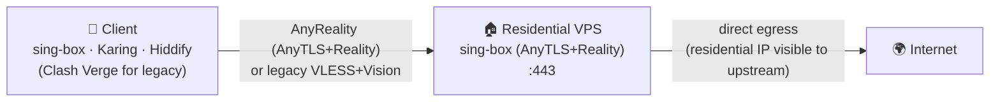
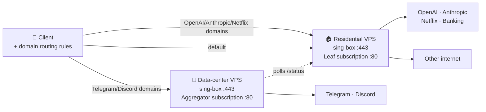

# anyreality-resi-stack — Residential-IP AnyReality (AnyTLS + Reality) stack for sing-box

> **住宅 IP AnyReality（AnyTLS + Reality）部署栈 / Residential-IP AnyReality stack for sing-box**
>
> `anyreality-resi-stack`（前身 `reality-resi-stack`）是一个面向个人和小团队的自托管代理部署工具包：用一条 Bash 安装命令在 Ubuntu / Debian VPS 上部署 **sing-box + AnyTLS + REALITY（AnyReality，默认）**，也可选旧的 **VLESS + Reality + xtls-rprx-vision**（legacy），并可选启用零依赖 Python 订阅服务、流量卡片和双节点智能分流。
>
> `anyreality-resi-stack` (formerly `reality-resi-stack`) is a self-hosted proxy deployment toolkit for individuals and small teams. It installs **sing-box + AnyTLS + REALITY (AnyReality, default)** — with legacy **VLESS + Reality + xtls-rprx-vision** still available — on Ubuntu/Debian VPS hosts, plus an optional zero-dependency Python subscription server, usage-card headers, and dual-node smart routing.

[](LICENSE)
[](docs/en/DEPLOYMENT.md)
[](https://sing-box.sagernet.org)
[](docs/en/DEPLOYMENT.md)
[](https://github.com/tytsxai/anyreality-resi-stack/releases)
[](https://github.com/tytsxai/anyreality-resi-stack/stargazers)

[English README](README.en.md) · [新手教程](docs/zh-CN/BEGINNER_GUIDE.md) · [命令示例](docs/zh-CN/EXAMPLES.md) · [常见问题 FAQ](docs/zh-CN/FAQ.md) · [分流规则](docs/zh-CN/ROUTING.md) · [同类评分对比](docs/zh-CN/COMPARISON.md) · [Docs (中文)](docs/zh-CN/DEPLOYMENT.md) · [Docs (English)](docs/en/DEPLOYMENT.md) · [llms.txt](llms.txt) · [Changelog](CHANGELOG.md) · [Issues](https://github.com/tytsxai/anyreality-resi-stack/issues)

> **Search keywords / 搜索关键词**: AnyReality, AnyTLS Reality, sing-box AnyTLS Reality installer, AnyReality 一键脚本, AnyReality 住宅 IP, residential IP VLESS, VLESS Reality residential proxy, sing-box residential installer, VLESS+Reality 一键脚本, OpenAI 住宅 IP 代理, ChatGPT 住宅 IP 出口, Telegram 住宅 IP 上传慢, Discord 住宅 IP 降权, Clash 域名分流, 双节点智能分流, alternative to 3x-ui for residential VPS

---

## 30 秒判断 | 30-second fit

- **中国区协议结论 / China protocol takeaway**: **AnyTLS + REALITY（AnyReality）= 当前中国区自建综合最优**（VLESS Reality 中国区已停滞）。量化论证见 [与其他协议的评分对比](#与其他协议的量化评分对比--为什么是中国区当前最优)。
- **它是什么 / What it is**: 一个开源、可审计、可重复部署的 **sing-box AnyReality (AnyTLS + Reality) installer**（默认协议，遗留 VLESS+Reality 仍可选），核心入口是 `install/install.sh`。
- **解决什么问题 / Problem solved**: 把你自己的住宅 IP VPS 或普通 VPS 配成可导入客户端的代理节点，并在需要时用双节点规则缓解 Telegram / Discord 对部分住宅 IP 段的软降权。
- **适合谁 / For whom**: 有自有 VPS、会 SSH、希望少维护 Web 面板的个人开发者、小团队、AI 工具用户和跨设备代理用户。
- **不是什么 / Not**: 不是住宅 IP 供应商、不是机场面板、不是多用户计费系统，也不承诺绕过账号风控或地区政策。
- **先知道的两件事 / Two things to know first**: ① 下发的客户端配置**自带国内直连、广告拦截等完整分流规则**，TUN 模式导入即用（[分流规则](docs/zh-CN/ROUTING.md)）；② 订阅服务跑在**明文 HTTP :80**，配置里含节点密码，**订阅 URL 等同于凭证，不要外传**（[SECURITY.md](SECURITY.md#subscription-url-exposure--订阅地址的暴露面)）。

**最小安装命令 / Minimal install command**

```bash
bash <(curl -fsSL https://raw.githubusercontent.com/tytsxai/anyreality-resi-stack/main/install/install.sh) \
  --node-name "US-Resi-01" \
  --sni addons.mozilla.org \
  --with-subscription
```

第一次部署建议先读 [新手教程](docs/zh-CN/BEGINNER_GUIDE.md) / [Beginner guide](docs/en/BEGINNER_GUIDE.md)。需要可重复部署时，用 `ANYREALITY_RESI_STACK_REF=<tag-or-branch>` 固定版本；自动化环境用 `--config FILE --non-interactive`。

## 项目速览 | Project summary

| 维度 | 中文 | English |
|---|---|---|
| 项目类型 | 开源自托管代理部署栈，不是机场面板，不出售 IP | Open-source self-hosted proxy deployment stack; not a proxy-selling panel |
| 核心用途 | 在住宅 IP VPS 或普通 VPS 上部署 sing-box AnyReality（AnyTLS+Reality，默认）或遗留 VLESS+Reality 节点，并生成可导入客户端的订阅配置 | Deploy sing-box AnyReality (AnyTLS+Reality, default) or legacy VLESS+Reality nodes and client subscription profiles on residential or regular VPS hosts |
| 解决的问题 | 住宅 IP 对 OpenAI / Anthropic / 银行 / Netflix 有价值，但 Telegram / Discord 等服务可能对住宅 IP 段软降权；本项目用域名规则把不同流量送到更合适的出口 | Residential egress can be valuable for OpenAI, Anthropic, banking, and streaming, while Telegram/Discord may downrank some residential subnets; this project routes traffic by domain to better exits |
| 适合谁 | 有自有 VPS、懂基本 SSH、希望少依赖面板的个人开发者、小团队、AI 工具用户、跨设备代理用户 | Developers, small teams, AI-tool users, and multi-device users who own VPS servers and prefer simple auditable automation |
| 技术栈 | Bash installer, sing-box, AnyTLS, Reality, VLESS, xtls-rprx-vision, Python 标准库 HTTP server, systemd, UFW, fail2ban, sing-box JSON / Clash YAML | Bash installer, sing-box, AnyTLS, Reality, VLESS, xtls-rprx-vision, Python stdlib HTTP server, systemd, UFW, fail2ban, sing-box JSON / Clash YAML |
| 支持系统 | Ubuntu 22.04+ / 24.04 LTS, Debian 12+ | Ubuntu 22.04+ / 24.04 LTS, Debian 12+ |
| 开源协议 | GPL-3.0 | GPL-3.0 |

## 仓库元信息 | Repository metadata

| 字段 | 值 |
|---|---|
| GitHub repository | `tytsxai/anyreality-resi-stack` |
| Former name / 前身 | `tytsxai/reality-resi-stack`（v1.x；旧链接会自动跳转到新仓库） |
| Primary installer | `install/install.sh` |
| Python package metadata | `subscription/pyproject.toml` |
| Runtime services | `sing-box`, `subscription-leaf`, `subscription-aggregator`, `config-backup.timer` |
| Main config paths | `/etc/sing-box/conf`, `/etc/anyreality-resi-stack/`, `/var/lib/anyreality-resi-stack/`（v2.0 起运行时路径、systemd 单元、备份脚本/归档统一为 `anyreality-resi-stack` 前缀；安装器会自动迁移 v1.x 的 `reality-resi-stack` 目录与单元，就地升级不丢密钥/状态/备份） |
| AI summary source | [`llms.txt`](llms.txt), [`docs/README.md`](docs/README.md) |
| Suggested GitHub About description | `Self-hosted residential-IP AnyReality (AnyTLS+Reality) / VLESS Reality stack for sing-box with Bash installer, Python subscription server, usage cards, and dual-node smart routing.` |
| Suggested GitHub Topics | `sing-box`, `anytls`, `anyreality`, `vless`, `reality`, `xtls`, `residential-ip`, `proxy`, `self-hosted`, `clash`, `subscription-server`, `v2rayn`, `telegram`, `openai`, `anthropic`, `ubuntu`, `debian`, `systemd` |

## 核心功能 | Core features

- **一行安装 / One-line install**: `install/install.sh` 完成系统预检、sing-box 安装、Reality 密钥生成、配置渲染、systemd 服务、UFW / fail2ban、备份 timer 和自检。
- **AnyTLS + REALITY（AnyReality，默认）**: 默认监听 `443/tcp`，无需域名和 TLS 证书；AnyTLS 的自定义填充让 TLS-in-TLS 更难被指纹识别，Reality 补齐服务端伪装。抗检测更强，仅 sing-box 生态支持。
- **VLESS + Reality + xtls-rprx-vision（legacy 可选）**: 加 `--protocol vless-vision` 切换；生态最成熟、Clash/mihomo 兼容，**仅在必须用 Clash 客户端时**使用。中国区该路线已停滞，新装默认不要选它。
- **订阅服务 / Subscription server**: `subscription/leaf_server.py` 用 Python 标准库提供 `/<TOKEN>/`、`/<TOKEN>/status`、`/healthz`，后台采样网卡用量，并通过 `Subscription-Userinfo` 响应头给客户端显示流量卡片。
- **开箱即用的分流规则 / Routing that works out of the box**: 下发的客户端配置自带四层规则 —— 内网直连、广告拦截、**国内域名/IP 直连（内联安全网 + `geosite-cn` / `geoip-cn` 双保险）**、QUIC 拦截，TUN 模式下导入即用，不需要手动配规则。详见 [分流规则](docs/zh-CN/ROUTING.md) / [Routing rules](docs/en/ROUTING.md)。
- **双节点智能分流 / Dual-node smart routing**: 可用住宅节点承载 OpenAI / Anthropic / Netflix 等流量，用数据中心节点承载 Telegram / Discord 等对住宅 IP 不友好的流量。
- **可运维性 / Operability**: 支持 `--dry-run`、`--non-interactive`、`--config`、幂等重跑、每日配置备份、日志限额、BBR、swap、健康检查。
- **安全边界 / Safety boundaries**: 每台服务器生成独立 UUID / Reality key / subscription token；仓库带脱敏扫描和哈希 denylist，避免把真实凭证提交到 Git。

## 新手从这里开始 | Start here

如果你第一次部署 AnyReality / VLESS Reality，不需要先理解所有协议细节。按下面顺序走：

1. 准备一台 Ubuntu 22.04+ / Debian 12+ VPS，确认能用 SSH 登录，并能开放 `443/tcp` 和可选的 `80/tcp`。
2. 先看 [新手教程](docs/zh-CN/BEGINNER_GUIDE.md)，它按“买 VPS 前检查 → SSH → dry-run → 正式安装 → 客户端导入 → 验证出口”的顺序写。
3. 只部署一台服务器时，直接用 `--with-subscription`；遇到 Telegram / Discord 上传慢，再看 [双节点智能分流](docs/zh-CN/DUAL-NODE.md)。
4. 想知道国内网站为什么是直连的、怎么加自己的域名，看 [分流规则](docs/zh-CN/ROUTING.md)。
5. 需要确认它和 3x-ui / x-ui / 手写配置怎么选，先看 [同类评分对比](docs/zh-CN/COMPARISON.md)。

English: the full English edition of this page is [README.en.md](README.en.md). If this is your first AnyReality / VLESS Reality deployment, start with the [beginner guide](docs/en/BEGINNER_GUIDE.md), then use the one-line installer below. The [comparison page](docs/en/COMPARISON.md) explains when this stack is a better fit than 3x-ui, x-ui, manual configs, or commercial panels.

## 为什么选它 | Why choose this stack

`anyreality-resi-stack` 不追求做成大而全的机场面板。它把范围收窄到一个更实际的问题：**你已经有 VPS，尤其是住宅 IP VPS，想用最少依赖部署一个可审计、可重跑、可给客户端导入的 AnyReality / VLESS Reality 节点**。

| 你关心的点 | 本项目怎么处理 |
|---|---|
| 小白能不能直接用 | 一行安装、dry-run、完成卡、订阅 URL、客户端导入教程 |
| 住宅 IP 有没有被用好 | 默认把住宅出口用于 OpenAI / Anthropic / Netflix / banking 等 IP 信誉敏感场景 |
| Telegram / Discord 慢怎么办 | 双节点模式内置 TG / Discord → 数据中心节点，OpenAI / Claude → 住宅节点 |
| 会不会变成面板安全负担 | 无 Web 管理后台，默认单用户单节点，减少暴露面 |
| 出问题能不能排查 | systemd 服务、`/healthz`、`Subscription-Userinfo`、日志命令、故障排查文档 |
| 会不会把密钥提交出去 | 每台服务器本地生成密钥，仓库带 redact 扫描和 hash denylist |

## 选型判断 | Which tool should I use?

| 场景 | 推荐 |
|---|---|
| 一台 VPS，想快速部署自用 AnyReality / VLESS Reality | `anyreality-resi-stack` |
| 住宅 IP 主要给 OpenAI / Claude / Netflix 用，但 TG / Discord 体验差 | `anyreality-resi-stack` 双节点模式 |
| 需要多用户、到期时间、流量限额、Web 面板和管理员 API | 3x-ui / x-ui 更合适 |
| 只是学习 Xray/sing-box 底层配置 | 手写配置或官方文档更合适 |
| 不想自管服务器，只想购买现成节点 | 商业机场/代理服务更省事 |

在“住宅 IP 自托管 AnyReality / VLESS Reality + 新手可落地 + 低维护”这个具体场景下，本项目的综合评分和取舍见 [同类评分对比](docs/zh-CN/COMPARISON.md) / [comparison](docs/en/COMPARISON.md)。

## 与其他协议的量化评分对比 | 为什么是中国区当前最优

> **一句话结论：在当前中国区自建场景下，AnyTLS + REALITY（AnyReality）是综合最优选择；本仓库默认即此协议。**
>
> 本节比的是**协议本身**（不是 3x-ui / x-ui 等面板工具）。评分场景固定为：
> **中国区用户 · 自建 / 机场节点 · 要抗检测 · 尽量少域名证书运维 · 能跟上游演进**。
>
> **上游跟进承诺**：下表不是写死的广告文案。协议生态、检测形势、客户端支持会变——我们会**按 [sing-box](https://sing-box.sagernet.org/) / AnyTLS / REALITY 及同类协议上游变更及时改分、改默认、改推荐**；安装器跟踪官方 apt 源，本表与 [Changelog](CHANGELOG.md) 随 release 同步。若某天有更强组合出现，会直接改默认，而不是死守旧叙事。
>
> **评分口径**（最近复核：2026-08）：产品判断，不是实验室基准、也不是“保证不被检测”。加权近似：抗检测 20% · 免域名伪装 20% · **中国区是否还在演进 20%** · 落地成本 10% · 历史稳定性 10% · 客户端广度 10% · 少运维自建契合 10%。权重刻意抬高「中国区演进」，所以「曾经生态第一但已停滞」会明显掉分。

### 30 秒决策树

```text
能用 sing-box 系客户端？
  ├─ 是 → 直接 AnyReality（本仓库默认）     ← 中国区当前最优
  └─ 否，必须 Clash / mihomo？
        └─ 暂时 --protocol vless-vision（兼容退路，不是更优协议）
              有机会换客户端时再迁回 AnyReality

已在用纯 AnyTLS？ → 补上 REALITY，上 AnyReality，不要裸跑
已在用 VLESS+REALITY（中国区）？ → 能换客户端就迁 AnyReality；不能换再暂留
弱网高丢包、要吃满 UDP 带宽？ → 可并行考虑 Hysteria2（赛道不同，不替代本方案）
已有完整域名+证书+反代？ → Trojan/TLS 仍可用，但运维更重，一般不优于 AnyReality
```

### 为什么说「中国区当前最优」

| 判断依据 | 说明 |
|---|---|
| 抗检测完整度 | AnyTLS 自定义填充压 TLS-in-TLS 特征，REALITY 补服务器指纹伪装——**填充 + 伪装都有**，比「只有 Reality」或「只有填充」更完整 |
| 无需域名证书 | 和经典 Reality 一样，不买域名、不续证书、不养真站，中国区自建落地成本最低档之一 |
| 中国区演进 | 原「大多数人首选」的 **VLESS + REALITY + XHTTP/Vision 在中国区已停滞**（社区/教程/面板默认路径不再推进该组合的新能力）；继续押旧路线 = 技术债 |
| 可迁移路径清晰 | 从停滞的 VLESS Reality、从纯 AnyTLS，**都应该直接迁到 AnyReality**，而不是两边凑合 |
| 本仓库落地 | 一键装、订阅（`profile.json`）、分流、双节点都按 AnyReality 默认打通；选它不是空推荐，是**默认就能用** |

**唯一结构性短板**：客户端主要在 **sing-box 系**（官方 App / Karing / Hiddify / NekoBox 等），**mihomo / 多数 Clash 系暂不支持**。被客户端锁死 → 用遗留 VLESS Vision 是**兼容妥协**，不是协议更优。

### 总分（中国区自建场景 · 协议横向）

| 协议 | 总分 | 中国区定位 | 为何输给 / 不敌 AnyReality |
|---|---:|---|---|
| **AnyTLS + REALITY（AnyReality）** | **4.6** | **当前最优 · 本仓库默认** | — |
| VLESS + REALITY + XHTTP / Vision | 3.7 | 曾经主流 · **现已停滞** | 生态仍广、长期稳，但**国内侧不再演进**；新装再选它是在买技术债 |
| Hysteria2 | 3.4 | 弱网特化 | 丢包场景强，但走 UDP/QUIC，**不是 REALITY 伪装赛道**；策略与特征模型不同 |
| 纯 AnyTLS（无 REALITY） | 3.1 | 半成品 | 有填充、**缺服务端伪装** → 应升级为 AnyReality，不是终点 |
| Trojan / 传统 TLS | 2.8 | 老牌备选 | 强依赖域名 + 证书 + 真站/反代；运维面大，无 REALITY 级借指纹 |
| Shadowsocks 2022 | 2.6 | 低审查 / 内网 | 部署极简，**TLS 层伪装与抗主动探测明显弱** |

未单独打分但常被问起的：`VMess`（旧特征多，中国区新装不推荐）、`NaiveProxy`（伪装好但依赖域名/反代与较重栈）、`TUIC` / 纯 QUIC 变体（与 Hysteria2 同属 UDP 赛道，不作 REALITY 替代）。它们不进入上表主对比，避免稀释「中国区自建默认该选谁」。

### 维度评分（越高越适合中国区自建）

| 维度（权重） | **AnyReality** | VLESS+R+XHTTP/Vision | Hysteria2 | 纯 AnyTLS | Trojan/TLS | SS2022 |
|---|---:|---:|---:|---:|---:|---:|
| 抗检测 / 流量特征（20%） | **5** | 4 | 3 | 3 | 3 | 2 |
| 服务端伪装 / 免自备域名证书（20%） | **5** | **5** | 2 | 2 | 1 | 1 |
| **中国区活跃度 / 是否还在演进（20%）** | **5** | **2（停滞）** | 4 | 4 | 2 | 3 |
| 配置与落地成本（10%） | 4 | 3 | 3 | 4 | 2 | **5** |
| 长期稳定性 · 历史实测（10%） | 4 | **5** | 4 | 3 | 4 | 4 |
| 客户端生态广度（10%） | 3 | **5** | 4 | 3 | **5** | **5** |
| 与「少运维自建」契合（10%） | **5** | 3 | 3 | 2 | 2 | 2 |

读表：VLESS Reality 在「生态 / 历史稳定性」仍能打，但在**中国区是否还在演进**上掉队——这是「曾经最优 ≠ 现在最优」的关键分差。AnyReality 用**填充 + REALITY 伪装 + 仍在演进**把总分拉到第一。

### 客户端支持（和分数直接相关的短板）

| 客户端 | AnyReality | 遗留 VLESS+Vision | 说明 |
|---|:---:|:---:|---|
| sing-box 官方 App（SFA/SFI/SFM）、Karing、Hiddify、NekoBox | ✅ | ✅ | **推荐路径**；默认订阅 `profile.json` |
| Clash Verge / mihomo / Stash 等 | ❌ | ✅ | 必须 `--protocol vless-vision`，订阅变 `profile.yaml` |
| 仅支持 `vless://` 的旧客户端 | ❌ | 视实现 | 不要硬上 AnyReality |

导入步骤见 [客户端导入](docs/zh-CN/CLIENTS.md)。

### 重点协议说明

#### AnyTLS + REALITY（AnyReality）— 中国区当前首选

- **优点**：自定义填充让 TLS-in-TLS 更难被针对；REALITY 补齐服务器伪装（无需域名证书）；sing-box 实现灵活，抓包侧伪装优秀。
- **缺点**：相对经典 Reality 仍较新；**mihomo 不支持**；生态主要在 sing-box。
- **适用**：**新装默认就选这个**；原 VLESS 中国区用户、纯 AnyTLS 用户，能换客户端就直接迁过来。
- **本仓库**：默认 `--protocol anytls-reality`（可省略）；认证字段是 `ANYTLS_PASSWORD`（密码），**没有** UUID / flow。

#### VLESS + REALITY + XHTTP / Vision — 中国区已停滞（不是现在的最优）

- **优点**：REALITY 无需域名证书、服务器指纹消除顶级；XHTTP / Vision 优化特征与性能；生态最成熟；实测长期稳定——**这些曾经支撑它成为「大多数人首选」**。
- **缺点**：dest 要选好（TLS 1.3 / H2 等）；Xray / sing-box 有细微差异；**中国区上游与社区演进已基本停滞** → 今天再当默认 = 押停更方案。
- **适用**：客户端只剩 Clash / mihomo；或既有节点短期维持。
- **本仓库**：`--protocol vless-vision`（legacy 兼容，**不是推荐首选**）。

#### 纯 AnyTLS — 半成品，直接上 AnyReality

有填充、无 REALITY 伪装。**AnyTLS 用户的更强选择就是 AnyReality**，不要停在纯 AnyTLS。

#### 其他协议（对照，不是「更优默认」）

| 协议 | 仍可考虑的窄场景 | 相对 AnyReality |
|---|---|---|
| Hysteria2 | 高丢包、要吃满带宽 | 赛道不同；不替代 REALITY 伪装方案 |
| Trojan / 传统 TLS | 已有完整域名证书反代 | 运维更重，无借指纹 |
| Shadowsocks 2022 | 内网 / 极低审查 | 抗探测与伪装弱一档 |

### 从旧协议迁到 AnyReality（本仓库）

1. 客户端换成 sing-box 系（见上表）。
2. 在服务器**重跑安装器**（默认同 AnyReality；或显式 `--protocol anytls-reality`）。安装器会换入站模板、必要时补 `ANYTLS_PASSWORD`，并避免双入站抢 443。
3. **客户端必须重新导入**订阅：认证从 UUID/flow 变成密码，默认 profile 从 `profile.yaml` 变成 `profile.json`。
4. 验证：`curl -x socks5h://127.0.0.1:2080 https://api.ipify.org` 应返回节点出口 IP。

详情：[部署指南 · 协议选择](docs/zh-CN/DEPLOYMENT.md#协议选择anyreality默认vs-vless-vision遗留) · [故障排查](docs/zh-CN/TROUBLESHOOTING.md)。

### 边界（避免过度承诺）

- 评分是**场景化产品判断**，不是吞吐量压测、也不是对抗审查的法律/合规保证。
- 「最优」指：**中国区自建默认该押哪条协议路线**；弱网 UDP、已有重 TLS 反代、必须用 Clash 等窄场景可以另选，见决策树。
- 本项目**不承诺**绕过任何账号风控、地区政策或协议检测；只负责把自有 VPS 配成可维护出口。

### 和本仓库的关系

| 层级 | 结论 |
|---|---|
| **协议层** | AnyReality = 中国区当前最优（上表） |
| **部署层** | `anyreality-resi-stack` 把该协议做成一键安装 + 订阅 + 分流；住宅 IP 双节点是额外场景加分 |
| **工具层** | 和 3x-ui / x-ui / 手写配置比，见 [同类评分对比](docs/zh-CN/COMPARISON.md) |

## 适用与不适用 | Fit and limits

**适合 / Good fit**

- 自己拥有住宅 IP VPS，希望把住宅出口用于 OpenAI、ChatGPT、Claude、银行、流媒体等重视 IP 信誉的场景。
- 已有一台住宅 VPS 和一台普通数据中心 VPS，想用域名分流把 Telegram / Discord 旁路到数据中心节点（默认 AnyReality 下为 sing-box `route` 规则）。
- 不想维护 3x-ui / x-ui 这类面板，只需要单用户、可审计、可重复部署的 AnyReality 节点（Clash 用户可用遗留 VLESS Vision）。
- 希望订阅 URL 在 sing-box 系（默认）或 Clash 系（legacy）客户端里同步配置并显示用量。

**不适合 / Not a fit**

- 不提供住宅 IP 或服务器资源；你需要自己准备 VPS。
- 不做多用户面板、计费系统、商用机场管理或企业级多租户隔离。
- 不支持 CentOS 7、Alpine、OpenWRT、Docker-only 或 Kubernetes 部署。
- 不承诺绕过任何服务的账号风控、地区政策或协议检测；它只负责把你自有服务器配置成可用的代理出口。

---

## 🌍 Why this exists | 这个项目为什么存在

**中文** —— 市面上大多数 VLESS 安装器（XHTTP-Installer、3x-ui、x-ui 等）服务的是"便宜 VPS 翻墙"场景；它们的设计假设是：服务器 IP 不值钱、出口 IP 越隐藏越好。

但**住宅 IP VPS 反过来**：你之所以花更高价钱买它，正是因为 **OpenAI / Anthropic / 银行 / Netflix 等"看重出口 IP 信誉"的服务**会奖励住宅出口。然而**同一个住宅 IP 段**经常被 Telegram、Discord 等即时通讯类服务降权（因为该段曾被其他人跑过 bot），表现就是**文件上传卡死、语音通话掉帧、"正在发送..." 一直转**。

`anyreality-resi-stack` 的设计前提：**把住宅 IP 当成资产用好，对它不友好的少数场景按域名旁路到备用节点**。

**English** — Most VLESS installers (XHTTP-Installer, 3x-ui, x-ui, ...) target the *cheap-VPS-bypass-censorship* use case. They assume your server IP is disposable and the more you hide it, the better.

**Premium residential-IP VPS is the opposite trade-off**: you bought it precisely *because* services that reward "real-home-user" reputation (OpenAI, Anthropic, banking, Netflix) treat residential egress better than data-center egress. But the same residential subnet often gets soft-throttled by messengers (Telegram, Discord) when a neighbor on the same /24 has previously been flagged. The symptom: stalled file uploads, dropped voice frames, sticky "sending…".

`anyreality-resi-stack` is built on the assumption that your residential IP is an asset worth defending — and that the few services hostile to it should be routed *around*, not despite, the asset.

---

## ⚡ Quick start | 一行部署

```bash
bash <(curl -fsSL https://raw.githubusercontent.com/tytsxai/anyreality-resi-stack/main/install/install.sh) \
  --node-name "US-Resi-01" \
  --sni addons.mozilla.org \
  --with-subscription
```

The quick-start command tracks `main`. Pin a branch or tag for repeatable installs with `ANYREALITY_RESI_STACK_REF=<ref>`.

**中文：** 上面这条命令会在你的 Ubuntu 22.04+ / Debian 12+ 服务器上完成：系统优化（BBR/swap/journald 限额）→ 安装 sing-box（apt 源 + GPG 指纹校验）→ 生成 UUID、Reality 密钥与 AnyTLS 密码 → 配置 **AnyReality（AnyTLS + Reality）入站**（默认；加 `--protocol vless-vision` 可切回遗留 VLESS+Reality）→ 启用 systemd 服务 → 配置 UFW + fail2ban → 安装订阅服务（带流量卡片）→ 安装每日配置备份 timer → 端到端自检。

**English:** This single command performs, on Ubuntu 22.04+ / Debian 12+: system tuning (BBR/swap/journald limits) → sing-box install (apt repo with pinned GPG fingerprint) → UUID / Reality keypair / AnyTLS password generation → **AnyReality (AnyTLS + Reality) inbound configuration** (default; pass `--protocol vless-vision` for legacy VLESS+Reality) → systemd service enablement → UFW + fail2ban → subscription server with usage card → daily systemd-timer backup → end-to-end self-check.

For a dual-node deployment with smart routing, use `--with-aggregator http://<leaf>/<token>/status` plus the residential-node variables documented in [docs/zh-CN/DUAL-NODE.md](docs/zh-CN/DUAL-NODE.md).

---

## 🚀 装完之后：三步用起来 | After install: 3 steps to go live

安装脚本结束时会打印一张完成卡，包含：节点名 / 协议 / IP / 端口 / SNI、**AnyReality 客户端凭据**（或遗留模式的 `vless://` 链接）、以及（启用订阅时的）订阅 URL `http://<你的IP>/<SUB_TOKEN>`。

The installer prints a completion card with node / protocol / IP / port / SNI, the **AnyReality client credentials** (or a `vless://` link in legacy mode), and — when the subscription server is enabled — a subscription URL `http://<your-ip>/<SUB_TOKEN>`.

**1. 拿到配置 / Get the config** — 两种方式二选一 / pick one:

```text
# 方式 A（推荐）：订阅 URL，客户端自动同步 + 流量卡片
#   AnyReality（默认）→ 用 sing-box 系客户端导入：sing-box 官方 App(SFA/SFI/SFM)、Karing、Hiddify
#   遗留 vless-vision → 用 Clash 系客户端导入：Clash Verge、mihomo、Stash
http://<your-ip>/<SUB_TOKEN>/

# 方式 B：手动。AnyReality 完整客户端配置样例（占位值，勿直接用）见：
examples/single-node/sing-box-client-config.json      # 单节点 AnyReality
examples/dual-node/sing-box-client-dual.json          # 双节点 AnyReality + 域名分流
examples/single-node/vless-link.txt                   # 遗留 vless:// 分享链接
```

**2. 导入客户端 / Import into a client** — 详见 [客户端导入 | Client import](docs/zh-CN/CLIENTS.md)。AnyReality 手动导入字段：`type=anytls`、`server`、`port`、`password`、`tls.server_name=<SNI>`、`utls fingerprint=chrome`、`reality public_key` + `short_id`。

**3. 验证出口 / Verify egress** — 导入的 sing-box 客户端默认在本地 `127.0.0.1:2080` 起一个混合代理，用它确认出口就是你的住宅 IP：

```bash
# 客户端侧：应返回你 VPS 的住宅 IP / Client side: should print your VPS residential IP
curl -x socks5h://127.0.0.1:2080 https://api.ipify.org

# 服务器侧健康检查 / Server-side health check
curl -fsS http://<your-ip>/healthz          # 订阅服务存活 / subscription liveness
systemctl status sing-box --no-pager        # 节点服务状态 / node service status
```

出口 IP 异常、客户端连不上、Telegram 仍然慢？见 [故障排查](docs/zh-CN/TROUBLESHOOTING.md) / [Troubleshooting](docs/en/TROUBLESHOOTING.md)。

---

## 🏗️ Architecture | 架构

### Single-node (default) | 单节点（默认）



### Dual-node with smart routing | 双节点 + 智能分流



Client downloads a *single* subscription URL from the aggregator. That URL returns a profile listing **both** nodes plus the routing rules — a full sing-box config (`profile.json`) by default with AnyReality, or a Clash profile (`profile.yaml`) under legacy `--protocol vless-vision`. Traffic accounting still reflects the residential node's quota (aggregator polls the leaf and caches the result, falling back gracefully if the leaf is briefly unreachable).

---

## ✨ Features | 特性

| Feature | 中文 |
|---|---|
| Domain-based smart routing (Telegram → DC, OpenAI → Resi) | 按域名智能分流（TG 走数据中心，OpenAI 走住宅） |
| AnyTLS + Reality (AnyReality, default) — custom padding, no domain / no TLS cert | AnyTLS + Reality（AnyReality，默认）——自定义填充、无需域名/证书 |
| Legacy VLESS + Reality + xtls-rprx-vision via `--protocol vless-vision` (Clash-compatible) | 遗留 VLESS + Reality + xtls-rprx-vision，用 `--protocol vless-vision`（兼容 Clash） |
| Bash installer with `--dry-run`, `--non-interactive`, `--config`, `--protocol` | Bash 模块化安装器，支持 `--dry-run`/`--non-interactive`/`--config`/`--protocol` |
| Official Sagernet apt source + verified GPG fingerprint | sing-box 官方 apt 源 + GPG 指纹校验 |
| Custom Python subscription server (zero deps, `Subscription-Userinfo`, `/healthz`) | 自写 Python 订阅服务（零依赖，含流量卡片、健康检查） |
| Dual-node aggregator with background polling and cache fallback (avoids "0 used" jitter on leaf outage) | 双节点聚合 + 后台轮询 + 缓存回退（leaf 短暂离线不会归零跳变） |
| Idempotent installer (re-runnable, no double-config drift) | 安装器幂等（重跑不会重复配置） |
| systemd-timer daily config backup | systemd timer 每日配置备份 |
| BBR / swap / journald / fail2ban out of the box | BBR / swap / journald 限额 / fail2ban 开箱即用 |
| Hash-only secret denylist + CI redact gate | 哈希列表 + CI 脱敏门禁，禁止凭证入库 |

---

## 📚 Documentation | 文档

| 中文 | English |
|---|---|
| [文档索引](docs/README.md) | [Documentation index](docs/README.md) |
| [新手教程](docs/zh-CN/BEGINNER_GUIDE.md) | [Beginner guide](docs/en/BEGINNER_GUIDE.md) |
| [常见问题 FAQ](docs/zh-CN/FAQ.md) | [FAQ](docs/en/FAQ.md) |
| [命令示例](docs/zh-CN/EXAMPLES.md) | [Usage examples](docs/en/EXAMPLES.md) |
| [部署](docs/zh-CN/DEPLOYMENT.md) | [Deployment](docs/en/DEPLOYMENT.md) |
| [订阅服务设计](docs/zh-CN/SUBSCRIPTION.md) | [Subscription server design](docs/en/SUBSCRIPTION.md) |
| [双节点 + 智能分流](docs/zh-CN/DUAL-NODE.md) | [Dual-node + smart routing](docs/en/DUAL-NODE.md) |
| [分流规则](docs/zh-CN/ROUTING.md) | [Client routing rules](docs/en/ROUTING.md) |
| [故障排查](docs/zh-CN/TROUBLESHOOTING.md) | [Troubleshooting](docs/en/TROUBLESHOOTING.md) |
| [客户端导入](docs/zh-CN/CLIENTS.md) | [Client import](docs/en/CLIENTS.md) |
| [同类评分对比](docs/zh-CN/COMPARISON.md) | [Comparison](docs/en/COMPARISON.md) |

For AI search engines and retrieval tools, see [llms.txt](llms.txt). It summarizes the repository purpose, boundaries, docs map, and useful search phrases in a compact machine-readable format.

面向 AI 搜索引擎和检索工具的项目摘要见 [llms.txt](llms.txt)，里面整理了项目用途、边界、文档地图和搜索短语。

---

## 🛡️ Security | 安全

- All secrets generated per-server; never committed.
- Repo CI gates on a hash-only denylist + secret-shape detector — no UUID, Reality key, or IP can land in a PR.
- Pinned GPG fingerprint for the sing-box apt repo. Refuses to install on mismatch.
- See [SECURITY.md](SECURITY.md) for threat model and reporting.

凭证不入库；CI 强制脱敏门禁；sing-box 安装走 GPG 指纹校验。详见 [SECURITY.md](SECURITY.md)。

> ⚠️ **订阅地址就是凭证 / The subscription URL is a credential.** 订阅服务跑在**明文 HTTP :80** 上，`http://<IP>/<SUB_TOKEN>/` 返回的配置里含节点密码 —— 链路上任何人都能读到，拿到 URL 就等于拿到你的节点。**不要**把完整 URL 贴进 issue、截图、聊天群；**不要**把备份文件放进 `FILE_DIR`（同一 token 路径会直接下发）。需要更强保护就在前面加 TLS 反代，或 `scp` 取一次配置后关掉订阅服务。完整说明见 [SECURITY.md](SECURITY.md#subscription-url-exposure--订阅地址的暴露面)。
>
> The subscription server is plain HTTP on :80 and the profile it returns contains your node password. Anyone who learns the URL has your node. Front it with a TLS reverse proxy, or fetch the profile once over `scp` and disable the server.

---

## ❓ FAQ

下面是最高频的几个问题。更完整的问答（安装参数、订阅安全、流量统计、分流行为、双节点、卸载、许可边界等 40+ 条）见 [常见问题 FAQ](docs/zh-CN/FAQ.md) / [FAQ (English)](docs/en/FAQ.md)。

**Q: 我的 Telegram 在住宅 VPS 上文件上传卡死、"正在发送..." 一直转,怎么办?**
Telegram 会对**历史上跑过 bot 的住宅 IP 段**做软降权。打开本仓库的**双节点模式**,把 `geosite:telegram` 通过数据中心备用节点出去,问题立刻解决。

**Q: OpenAI / ChatGPT 在数据中心 VPS 上提示 "unsupported region",换住宅 VPS 就好了 —— 但 Telegram 又变慢。怎么两个都顾?**
这就是这个项目存在的全部理由:**OpenAI / Anthropic / 银行 / Netflix 走住宅出口,Telegram / Discord 走数据中心节点**,客户端只看到一份订阅。

**Q: 默认协议是什么?AnyReality 和 VLESS+Reality 怎么选?**
默认是 **AnyReality（AnyTLS + Reality）**——按我们的评分,这是**当前中国区自建的综合最优协议**(填充 + REALITY 伪装 + 仍在演进)。AnyTLS 自定义填充让 TLS-in-TLS 更难被针对,Reality 补齐服务端伪装,但**只有 sing-box 生态支持**(官方 App、Karing、Hiddify 等)。**VLESS + REALITY 中国区已停滞**,曾经是「大多数人首选」,现在新装不应再默认押它;纯 AnyTLS 也应升级为 AnyReality。仅当客户端是 Clash 系(Clash Verge、mihomo、Stash)**不支持 AnyReality**时,才用 `--protocol vless-vision` 走遗留兼容。两者都无需域名和证书。完整论证与打分见 [与其他协议的量化评分对比](#与其他协议的量化评分对比--为什么是中国区当前最优)。

**Q: 刚导入订阅,连国内网站(淘宝、微信、B 站、网银)都变得又慢又卡,是节点问题吗?**
不是。TUN 模式下**没有"全局/直连"开关,流量走不走代理完全由规则决定**,规则不完善就会把国内流量也发去海外。本项目下发的客户端配置**自带四层分流规则**(内网直连 → 广告拦截 → 国内直连 → 兜底走节点),导入即用。如果你手改过配置或用了别处的模板,对照 [分流规则](docs/zh-CN/ROUTING.md) 检查。另外注意:`geosite-cn` 规则集要从 GitHub 下载,首次启动下不来就会整个失效 —— 所以本项目在它前面额外内联了一份约 60 条的国内域名安全网,不依赖任何网络请求。

**Q: 订阅 URL 是 HTTPS 吗?能公开分享吗?**
不是 HTTPS,是**明文 HTTP :80**;而且返回的配置里含节点密码。**拿到 URL 就等于拿到你的节点**,绝对不要公开分享、贴进 issue 或截图。要加密就自己在前面加一层 TLS 反代,或者用 `scp` 取一次配置后把订阅服务关掉。另外别把备份文件放进 `FILE_DIR`,同一个 token 路径会把它一起下发出去。详见 [SECURITY.md](SECURITY.md#subscription-url-exposure--订阅地址的暴露面)。

**Q: Reality 协议需要域名和证书吗?**
不需要,这是它相对 Trojan / V2Ray-TLS 的最大优势。AnyReality 和遗留 VLESS 模式都一样:默认伪装 SNI 是 `addons.mozilla.org`,你可以换成任何高信誉域名。

**Q: 默认配置为什么把 UDP 443 (QUIC / HTTP3) 拦掉了?**
AnyTLS + Reality 是纯 TCP 协议,QUIC 流量没法走节点。不拦的话浏览器会一直尝试 HTTP/3、超时后才回落 TCP,表现就是"打开网页前先卡几秒"。拦掉 `udp:443` 是让它**立刻**回落 TCP。不需要这个行为就删掉那条规则,见 [分流规则](docs/zh-CN/ROUTING.md#想改默认行为)。

**Q: 这工具和 3x-ui / x-ui / XHTTP-Installer 有什么区别?**
那些是为「便宜 VPS 翻墙」设计的(多用户、面板、隐藏出口 IP)。本项目是为**住宅 IP VPS 是资产**这个完全相反的前提设计的 —— 默认单 UUID、不藏 IP、按域名把对住宅 IP 不友好的少数服务旁路掉。

其余问题 —— 安装脚本幂等性、为什么只支持 Ubuntu 22.04+ / Debian 12+、如何固定版本与无人值守安装、订阅 URL 找回、流量统计口径、双节点部署、卸载与回滚、GPL-3.0 商用边界 —— 见 [完整 FAQ](docs/zh-CN/FAQ.md)。

## 🤝 Contributing | 贡献

PRs welcome. Read [CONTRIBUTING.md](CONTRIBUTING.md) first — lint gates are strict, and any change touching install scripts must pass `make test && make lint && make redact && make examples`.

欢迎 PR。请先看 [CONTRIBUTING.md](CONTRIBUTING.md)；安装脚本相关改动必须通过 `make test && make lint && make redact && make examples`。

---

## 📜 License

GPL-3.0. See [LICENSE](LICENSE).

## Star History

[](https://www.star-history.com/#tytsxai/anyreality-resi-stack&Date)
