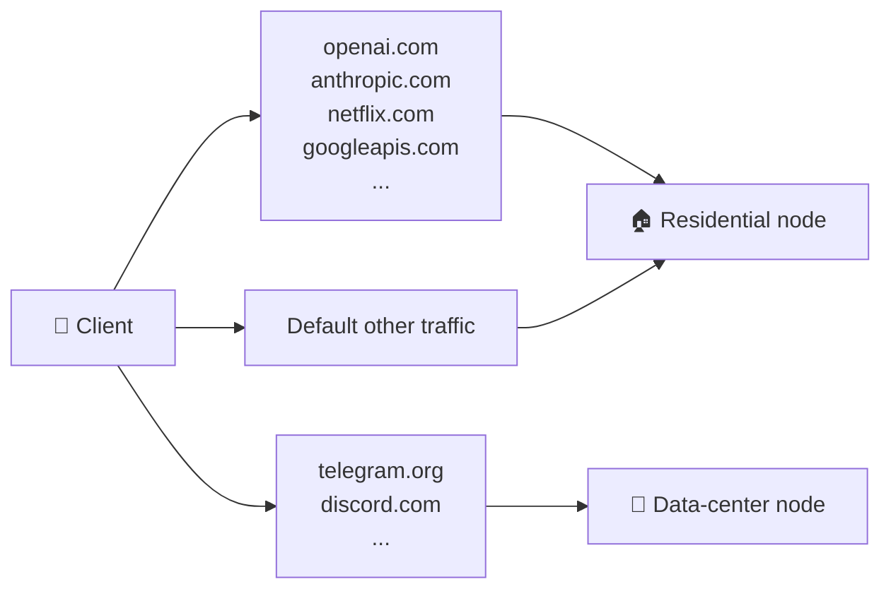

# Dual-node + smart routing

## A real scenario: Telegram uploads stall

You paid extra for a premium US residential-IP VPS. It performs beautifully on OpenAI, ChatGPT, Claude, Google AI, Netflix, banking logins — these services treat traffic from "real home broadband" as trusted, don't throw captchas, don't downrank.

Then one day you notice **Telegram file uploads, image sends, voice calls** are awful:

- Image sends stay stuck on "sending..."
- Voice calls choppy on your side
- Large file uploads crawl
- Plain text messages are fine, somehow

This isn't your network. It isn't sing-box. **It's residential-subnet "proxy suspicion" soft-throttling.**

### Why residential IPs get soft-throttled by Telegram

Anti-abuse systems at Telegram, Discord, and similar messengers track IP-subnet history. If anyone in your residential /24 has previously run bots, mass-account-registration tools, or scraping, the whole subnet's reputation drops. The action isn't usually a ban — it's a *soft throttle*:

- Large-file uploads rate-limited to a crawl
- Voice calls routed to lower-quality relays
- Frequent verification challenges
- Some features silently degraded

The throttle is **not** based on anything your specific account has done. It's collective-punishment-by-subnet.

### Why data-center IPs are paradoxically better here

Counter-intuitively: data-center IP ranges (DigitalOcean, Vultr, Linode, RackNerd) usually have **better** Telegram experience than budget residential subnets. The anti-abuse classifier handles DC ranges more granularly, and individual proxies on DC ranges happen to be less common than residential abuse (most personal-proxy operators choose residential to look "real").

---

## The fix: domain-based smart routing

`anyreality-resi-stack` is built around this insight: **acknowledge residential IPs aren't universally optimal; route by domain to whichever exit fits.**



With the default AnyReality protocol, the dual-node subscription returns a **full sing-box client config (`profile.json`)**: two `anytls` outbounds (residential node + data-center node) plus a set of sing-box `route` rules. Routing is a **static rule table** that maps domains/IPs straight to an outbound — not Clash's `url-test` latency groups. See [`examples/dual-node/sing-box-client-dual.json`](../../examples/dual-node/sing-box-client-dual.json) for the full example; an excerpt:

```json
"route": {
  "rules": [
    { "ip_is_private": true, "outbound": "direct" },

    // Residential IP is the asset → route to the residential node
    { "domain_suffix": ["openai.com", "chatgpt.com", "anthropic.com",
        "claude.ai", "googleapis.com", "gemini.google.com", "netflix.com"],
      "outbound": "US-Resi-01" },

    // Residential IPs are downranked here → route to the DC node
    { "domain_suffix": ["telegram.org", "t.me", "telegram.me",
        "discord.com", "discord.gg"],
      "outbound": "US-DC-01" },
    { "ip_cidr": ["91.108.4.0/22", "91.108.16.0/22", "149.154.160.0/20"],
      "outbound": "US-DC-01" }
  ],
  "final": "US-Resi-01"
}
```

Legacy vless-vision still uses Clash: the subscription returns `profile.yaml` and expresses routing with Clash `proxy-groups` + `rules`. The rule source is in `templates/clash/client-dual.yaml.tmpl`; an excerpt:

```yaml
rules:
  # Residential IP is the asset → route to RESI
  - DOMAIN-SUFFIX,openai.com,RESI
  - DOMAIN-SUFFIX,chatgpt.com,RESI
  - DOMAIN-SUFFIX,anthropic.com,RESI
  - DOMAIN-SUFFIX,claude.ai,RESI
  - DOMAIN-SUFFIX,googleapis.com,RESI
  - DOMAIN-SUFFIX,gemini.google.com,RESI
  - DOMAIN-SUFFIX,netflix.com,RESI

  # Residential IPs are often downranked here → route to DC
  - DOMAIN-SUFFIX,telegram.org,DC
  - DOMAIN-SUFFIX,t.me,DC
  - DOMAIN-SUFFIX,telegram.me,DC
  - IP-CIDR,91.108.4.0/22,DC,no-resolve
  - IP-CIDR,91.108.16.0/22,DC,no-resolve
  - IP-CIDR,149.154.160.0/20,DC,no-resolve
  - DOMAIN-SUFFIX,discord.com,DC
  - DOMAIN-SUFFIX,discord.gg,DC

  # Defaults
  - GEOSITE,CN,DIRECT
  - GEOIP,CN,DIRECT,no-resolve
  - MATCH,AUTO
```

---

## Deploying dual-node (5 minutes)

Assumes you already have the residential leaf running per [DEPLOYMENT.md](DEPLOYMENT.md).

### Step 1: get residential-node values from the leaf

```bash
grep ^SUB_TOKEN /etc/anyreality-resi-stack/secrets.env
grep ^ANYTLS_PASSWORD /etc/anyreality-resi-stack/secrets.env   # default AnyReality
grep ^UUID /etc/anyreality-resi-stack/secrets.env              # legacy vless-vision
grep ^REALITY_PUBLIC_KEY /etc/anyreality-resi-stack/secrets.env
ip route get 1.1.1.1 | grep -oP 'src \K\S+'   # leaf's public IP
```

You need the leaf's `SUB_TOKEN`, `REALITY_PUBLIC_KEY`, public IP, and the auth credential: `ANYTLS_PASSWORD` for the default AnyReality, or `UUID` for legacy vless-vision. Do not copy `REALITY_PRIVATE_KEY` to the backup node, and do not paste these values into public issues.

### Step 2: on the data-center VPS

```bash
cat > /root/aggregator.env <<'EOF'
RESI_SERVER_IP=<LEAF_IP>
RESI_UUID=<LEAF_UUID>
RESI_REALITY_PUBLIC_KEY=<LEAF_REALITY_PUBLIC_KEY>
RESI_NODE_NAME=US-Resi-01
RESI_ANYTLS_PASSWORD=<LEAF_ANYTLS_PASSWORD>
RESI_SNI=addons.mozilla.org
RESI_INBOUND_PORT=443
EOF

bash <(curl -fsSL .../install.sh) \
  --config /root/aggregator.env \
  --node-name "US-DC-01" \
  --sni addons.mozilla.org \
  --with-aggregator "http://<LEAF_IP>/<SUB_TOKEN>/status"
```

Aggregator mode will:
- Install sing-box (the DC node's own inbound — an AnyTLS inbound under the default AnyReality, a VLESS inbound under legacy)
- Install the aggregator subscription server
- Render the dual-node client subscription (default AnyReality → sing-box `profile.json` with two `anytls` outbounds + the sing-box route rules above; legacy vless-vision → Clash `profile.yaml`)
- Configure cache fallback

The `RESI_*` variables write the residential node into the client profile served by the aggregator. Under the default AnyReality, the aggregator needs the residential node's **AnyTLS password** — the `ANYTLS_PASSWORD` you read off the leaf in Step 1 — supplied via `RESI_ANYTLS_PASSWORD` (in the `--config` file or as an environment variable). The data-center node's own password defaults to the local `ANYTLS_PASSWORD`. If `RESI_SERVER_IP`, `RESI_UUID`, `RESI_REALITY_PUBLIC_KEY`, `RESI_NODE_NAME` (or, under AnyReality, `RESI_ANYTLS_PASSWORD`) is missing, the installer stops before rendering a broken subscription.

> Legacy vless-vision authenticates with a UUID and does not need `RESI_ANYTLS_PASSWORD`; the DC node's `DC_*` values default to the UUID, Reality public key, node name, and public IP generated on this install.

### Step 3: clients subscribe only to the aggregator URL

```text
http://<DC_IP>/<AGGREGATOR_SUB_TOKEN>/
```

This URL gives every client both nodes and all rules (a `profile.json` under the default AnyReality, a `profile.yaml` under legacy). **No extra client configuration needed.** Import it with a client that matches the protocol: a sing-box-based client for AnyReality, a Clash-based client for legacy vless-vision.

---

## Decision tree: do you need this?

```
Only one VPS?
├─ yes → Single-node is enough. This doc doesn't apply.
└─ no
   ↓
   Do you hit slow Telegram/Discord uploads or choppy voice?
   ├─ yes → Strongly recommend dual-node + smart routing
   └─ no
      ↓
      Do you want primary-backup HA?
      ├─ yes → Dual-node is reasonable
      └─ no  → Single-node is fine
```

Don't enable dual-node "just in case" — maintenance doubles, debugging surface doubles, you watch two billing dashboards.

---

## Traffic-counter semantics in dual-node

The aggregator's `Subscription-Userinfo` reflects **the leaf's counter**, because:

- Residential plans usually have tight bandwidth quotas (the number you actually care about)
- DC plans usually have abundant bandwidth (no need to surface this to the client)

The aggregator's own DC traffic doesn't appear in the card; check the DC provider's dashboard for that. To display *both* nodes' usage, you'd need a leaf on the DC node too plus an aggregator that polls multiple leaves — that's v2 scope, not currently supported.

---

## When to extend the routing rules

The defaults cover the two most common "residential is asset vs residential is downranked" classes. You might add:

- **Banking / brokerage**: route to RESI (residential reputation = no friction, no 2FA prompts)
- **GitHub / npm**: route to DC (GitHub rate-limits residential IPs harder than DC IPs)
- **Reddit / Twitter**: route to DC (their anti-bot is more aggressive on residential subnets)

Under the default AnyReality, edit `route.rules` in `/etc/anyreality-resi-stack/files/profile.json` (add `domain_suffix` entries to the desired `outbound`); under legacy vless-vision, edit the `rules:` section of `/etc/anyreality-resi-stack/files/profile.yaml`. Then restart the aggregator. Clients pick up the new rules on the next subscription refresh.

---

## Rotating subscription URLs without breaking clients

If you want to change the aggregator's token or move IPs, **don't** just kill the old URL. Recipe:

1. Bring up the new URL
2. Notify clients out-of-band (TG group, email)
3. **Keep the old URL alive for at least 7 days** (covers the 24h refresh cycle plus user procrastination)
4. Take down after 7 days

If notification is hard, you can repurpose the old aggregator's `DEFAULT_TARGET` to a single-line "migration notice" YAML — old clients see a deliberate "use new URL" message rather than an error.

---

## Cache fallback in practice

What aggregator does when the leaf is briefly down:

```
T+0:    Leaf healthy
        Aggregator cache: {used: 100 GiB, cached_at: T+0}
        Client subscription → returns 100 GiB

T+10s:  Leaf goes down
        Cache still fresh
        Client subscription → returns 100 GiB (cache hit)

T+90s:  Cache stale (CACHE_TTL_SECONDS=60)
        Aggregator tries leaf, connection fails
        Client subscription → returns 100 GiB (stale-cache fallback, not 0)

T+1h:   Leaf recovers
        Aggregator pulls fresh data
        Next client refresh → returns the real value
```

The visible result: **the client usage card never visibly drops to zero**. Admitting "data slightly stale" is much friendlier than admitting "data missing."

---

## Next

- First deployment should start single-node → [BEGINNER_GUIDE.md](BEGINNER_GUIDE.md)
- Subscription endpoint contract → [SUBSCRIPTION.md](SUBSCRIPTION.md)
- Still choosing between a panel and this stack → [COMPARISON.md](COMPARISON.md)
- Things break after going dual-node → [TROUBLESHOOTING.md](TROUBLESHOOTING.md)
