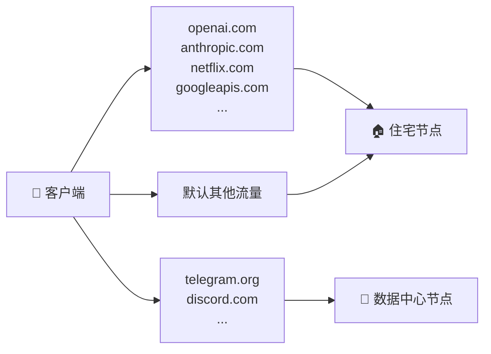

# 双节点 + 智能分流 | Dual-node + smart routing

## 一个真实场景：Telegram 上传卡死

你花更高的钱买了一台美国精品住宅 IP VPS。它在 OpenAI、ChatGPT、Claude、Google AI、Netflix、银行登录上表现优秀 —— 这些服务把"来自家庭宽带"的请求当成可信流量，不会动不动弹验证码、不会因风控降速。

但是有一天你发现 **Telegram 发图、发文件、语音通话** 体验变得糟糕：

- 发一张图，"正在发送..." 一直转
- 语音通话对面说卡顿
- 文件上传进度走得极慢
- 普通文字消息倒是正常

这不是你的网络问题，也不是 sing-box 的问题。**这是住宅 IP 段的"代理嫌疑"软风控**。

### 为什么住宅 IP 会被 Telegram 软风控

Telegram、Discord 等即时通讯服务的反滥用系统会跟踪 IP 段的历史行为。如果你买的住宅 IP 所在的 /24 子网过去有人跑过 bot、群发工具、批量账号注册，整段 IP 信誉就会被降级。它们的处理方式通常不是"封"，而是"软风控"：

- 大文件上传速率限到极低
- 语音通话被分到低质量中继
- 频繁要求验证码
- 部分功能被静默禁用

这些限制**对你这个具体账号没有任何过错记录**，纯粹是 IP 段连坐。

### 为什么数据中心 IP 反而更顺

矛盾的是：数据中心 IP（DigitalOcean、Vultr、Linode、RackNerd 等）在 Telegram 体验通常**好于**便宜的住宅 IP 段。原因是 Telegram 的反滥用系统对数据中心 IP 段有更细的分类，且这些段被用作个人代理的频率反而较低（个人代理多用住宅段冒充家庭流量）。

---

## 解决方案：按域名分流

`anyreality-resi-stack` 的核心设计就是：**承认住宅 IP 不是万能的，按域名把流量送到合适的出口**。



默认协议 AnyReality 下，双节点订阅返回的是**完整的 sing-box 客户端配置（`profile.json`）**：两个 `anytls` outbound（住宅节点 + 数据中心节点）加一套 sing-box `route` 规则。分流是**静态规则表**，直接把域名/IP 映射到某个出口，而不是 Clash 的 `url-test` 测速分组。完整示例见 [`examples/dual-node/sing-box-client-dual.json`](../../examples/dual-node/sing-box-client-dual.json)，摘录核心段：

```json
"route": {
  "rules": [
    { "ip_is_private": true, "outbound": "direct" },

    // 住宅 IP 是优势 → 路由到住宅节点
    { "domain_suffix": ["openai.com", "chatgpt.com", "anthropic.com",
        "claude.ai", "googleapis.com", "gemini.google.com", "netflix.com"],
      "outbound": "US-Resi-01" },

    // 住宅 IP 在这些服务上常被降权 → 路由到数据中心节点
    { "domain_suffix": ["telegram.org", "t.me", "telegram.me",
        "discord.com", "discord.gg"],
      "outbound": "US-DC-01" },
    { "ip_cidr": ["91.108.4.0/22", "91.108.16.0/22", "149.154.160.0/20"],
      "outbound": "US-DC-01" }
  ],
  "final": "US-Resi-01"
}
```

遗留协议 vless-vision 仍走 Clash：订阅返回 `profile.yaml`，用 Clash 的 `proxy-groups` + `rules` 表达分流。规则源码在 `templates/clash/client-dual.yaml.tmpl`，摘录核心段：

```yaml
rules:
  # 住宅 IP 是优势 → 路由到 RESI
  - DOMAIN-SUFFIX,openai.com,RESI
  - DOMAIN-SUFFIX,chatgpt.com,RESI
  - DOMAIN-SUFFIX,anthropic.com,RESI
  - DOMAIN-SUFFIX,claude.ai,RESI
  - DOMAIN-SUFFIX,googleapis.com,RESI
  - DOMAIN-SUFFIX,gemini.google.com,RESI
  - DOMAIN-SUFFIX,netflix.com,RESI

  # 住宅 IP 在这些服务上常被降权 → 路由到 DC
  - DOMAIN-SUFFIX,telegram.org,DC
  - DOMAIN-SUFFIX,t.me,DC
  - DOMAIN-SUFFIX,telegram.me,DC
  - IP-CIDR,91.108.4.0/22,DC,no-resolve
  - IP-CIDR,91.108.16.0/22,DC,no-resolve
  - IP-CIDR,149.154.160.0/20,DC,no-resolve
  - DOMAIN-SUFFIX,discord.com,DC
  - DOMAIN-SUFFIX,discord.gg,DC

  # 默认
  - GEOSITE,CN,DIRECT
  - GEOIP,CN,DIRECT,no-resolve
  - MATCH,AUTO
```

---

## 部署双节点（5 分钟）

假设你已经按 [DEPLOYMENT.md](DEPLOYMENT.md) 跑通了第一台机器（住宅 leaf）。

### 第 1 步：在 leaf 上记下住宅节点信息

```bash
grep ^SUB_TOKEN /etc/anyreality-resi-stack/secrets.env
grep ^ANYTLS_PASSWORD /etc/anyreality-resi-stack/secrets.env   # 默认 AnyReality 用
grep ^UUID /etc/anyreality-resi-stack/secrets.env              # 遗留 vless-vision 用
grep ^REALITY_PUBLIC_KEY /etc/anyreality-resi-stack/secrets.env
ip route get 1.1.1.1 | grep -oP 'src \K\S+'   # leaf 的公网 IP
```

得到 leaf 的 `SUB_TOKEN`、`REALITY_PUBLIC_KEY`、公网 IP，以及认证凭据：默认 AnyReality 取 `ANYTLS_PASSWORD`，遗留 vless-vision 取 `UUID`。不要把 `REALITY_PRIVATE_KEY` 复制到备用节点，也不要把这些值贴到公开 issue。

### 第 2 步：在备用数据中心 VPS 上跑

```bash
cat > /root/aggregator.env <<'EOF'
RESI_SERVER_IP=<LEAF_IP>
RESI_UUID=<LEAF_UUID>
RESI_REALITY_PUBLIC_KEY=<LEAF_REALITY_PUBLIC_KEY>
RESI_NODE_NAME=US-Resi-01
RESI_ANYTLS_PASSWORD=<LEAF_ANYTLS_PASSWORD>
RESI_SNI=addons.mozilla.org
RESI_INBOUND_PORT=443
EOF

bash <(curl -fsSL .../install.sh) \
  --config /root/aggregator.env \
  --node-name "US-DC-01" \
  --sni addons.mozilla.org \
  --with-aggregator "http://<LEAF_IP>/<SUB_TOKEN>/status"
```

aggregator 模式会：
- 装 sing-box（数据中心节点自身的入站；默认 AnyReality 的 AnyTLS 入站，遗留则为 VLESS 入站）
- 装 aggregator 订阅服务
- 渲染双节点客户端订阅（默认 AnyReality → sing-box `profile.json`，含两个 `anytls` outbound + 上面那套 sing-box route 规则；遗留 vless-vision → Clash `profile.yaml`）
- 配置缓存回退

`RESI_*` 变量用于把住宅节点写进 aggregator 返回的客户端订阅。默认 AnyReality 下，聚合器需要住宅节点的 **AnyTLS 密码**，即第 1 步在 leaf 上取到的 `ANYTLS_PASSWORD`，通过 `RESI_ANYTLS_PASSWORD` 提供（`--config` 文件或环境变量均可）；备用数据中心节点自身的密码默认取本机 `ANYTLS_PASSWORD`。缺少 `RESI_SERVER_IP`、`RESI_UUID`、`RESI_REALITY_PUBLIC_KEY`、`RESI_NODE_NAME`（以及 AnyReality 下的 `RESI_ANYTLS_PASSWORD`）时，安装器会直接停止，避免生成半坏订阅。

> 遗留 vless-vision 用 UUID 认证，不需要 `RESI_ANYTLS_PASSWORD`；数据中心节点的 `DC_*` 值默认由本次安装新生成的 UUID、Reality public key、`--node-name` 和本机公网 IP 派生。

### 第 3 步：客户端只订阅 aggregator 的 URL

```text
http://<DC_IP>/<AGGREGATOR_SUB_TOKEN>/
```

把这个 URL 给所有客户端。订阅返回的配置（默认 AnyReality 为 `profile.json`，遗留为 `profile.yaml`）同时含两个节点和分流规则，客户端**不需要做任何额外配置**。用与协议匹配的客户端导入：AnyReality 用 sing-box 系客户端，遗留 vless-vision 用 Clash 系客户端。

---

## 决策树：你需不需要双节点？

```
你只有一台 VPS 吗？
├─ 是 → 单节点即可。本文档不适用。
└─ 否
   ↓
   你有遇到 Telegram/Discord 上传慢、语音卡的问题吗？
   ├─ 是 → 强烈建议双节点 + 智能分流
   └─ 否
      ↓
      你想要主备 HA（主节点出问题切备用）吗？
      ├─ 是 → 双节点合理
      └─ 否 → 单节点足够
```

不要为"将来可能用"而上双节点：维护成本翻倍、调试范围翻倍、流量计费要看两份。

---

## 流量统计在双节点下的语义

aggregator 输出的 `Subscription-Userinfo` 来自 **leaf 的统计**，因为：

- 住宅节点通常带宽配额紧（你才在意它的剩余量）
- 数据中心节点带宽通常宽裕（不需要在客户端卡片显示）

aggregator 自己消耗的数据中心节点流量不会出现在卡片里，要看数据中心后台。如果你希望显示数据中心节点的流量，需要把另一台 leaf 部在数据中心节点上 + 让 aggregator 同时聚合两个 leaf —— 这是 v2 范围，目前不支持。

---

## 何时调整分流规则

默认规则覆盖了最常见的"住宅有优势 vs 住宅被降权"两类。你可能想加：

- **银行 / 证券**：路由到 RESI（住宅 IP 信誉 = 不被风控 = 不弹双因子）
- **GitHub / npm**：路由到 DC（GitHub 对住宅 IP 的 rate-limit 比数据中心 IP 严）
- **Reddit / Twitter**：路由到 DC（住宅 IP 段被 anti-bot 系统标记的概率更高）

默认 AnyReality 改 `/etc/anyreality-resi-stack/files/profile.json` 的 `route.rules`（加 `domain_suffix` 到对应 `outbound`）；遗留 vless-vision 改 `/etc/anyreality-resi-stack/files/profile.yaml` 的 `rules:` 段。改完 **重启 aggregator 服务**（让模板重新渲染）：

```bash
sudo systemctl restart subscription-aggregator
```

客户端下次同步订阅就会拿到新规则。

---

## 切换订阅 URL 不打断客户端

如果你想换 aggregator 的 token、或者换 IP，**不要**直接关旧 URL。流程：

1. 在新 URL 上线
2. 通过现有渠道（TG 群、邮件）通知客户端切到新 URL
3. **旧 URL 多保留至少 7 天**（让 24h 周期 + 用户惰性都跟得上）
4. 7 天后再下线旧 URL

如果嫌麻烦，可以在旧 aggregator 服务上把 `DEFAULT_TARGET` 换成一个特殊文件（比如 `migrate.yaml`），里面只有一行注释 "请用新订阅 URL: http://..."。这样旧客户端拿到的就是个"通知"，而不是错误。

---

## 缓存回退的实际效果

leaf 不可达时 aggregator 的行为：

```
T+0:    leaf 正常
        aggregator 缓存 {used: 100GiB, cached_at: T+0}
        客户端订阅 → 返回 100GiB

T+10s:  leaf 宕机
        aggregator 缓存还新鲜
        客户端订阅 → 返回 100GiB（缓存命中）

T+90s:  缓存过期（CACHE_TTL_SECONDS=60）
        aggregator 尝试 leaf，连不通
        客户端订阅 → 返回 100GiB（缓存兜底，不是 0）

T+1h:   leaf 恢复
        aggregator 拉到 leaf 的最新数据
        客户端下次订阅 → 返回真实值
```

关键点：**客户端流量卡片不会出现"突然清零"的视觉跳变**，承认数据稍微过期比承认数据缺失友好得多。

---

## 下一步

- 第一次部署先走单节点 → [BEGINNER_GUIDE.md](BEGINNER_GUIDE.md)
- 订阅服务的内部端点设计 → [SUBSCRIPTION.md](SUBSCRIPTION.md)
- 还在比较是否该用面板 → [COMPARISON.md](COMPARISON.md)
- 双节点跑起来后出问题 → [TROUBLESHOOTING.md](TROUBLESHOOTING.md)
